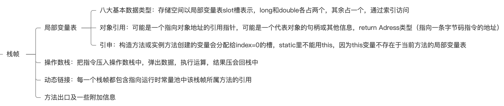
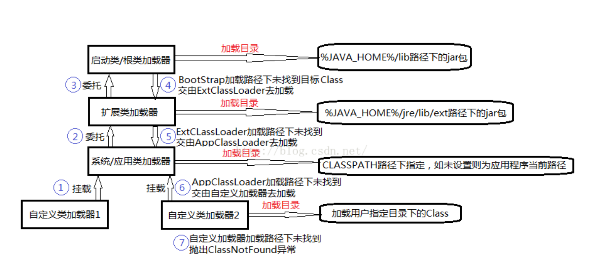
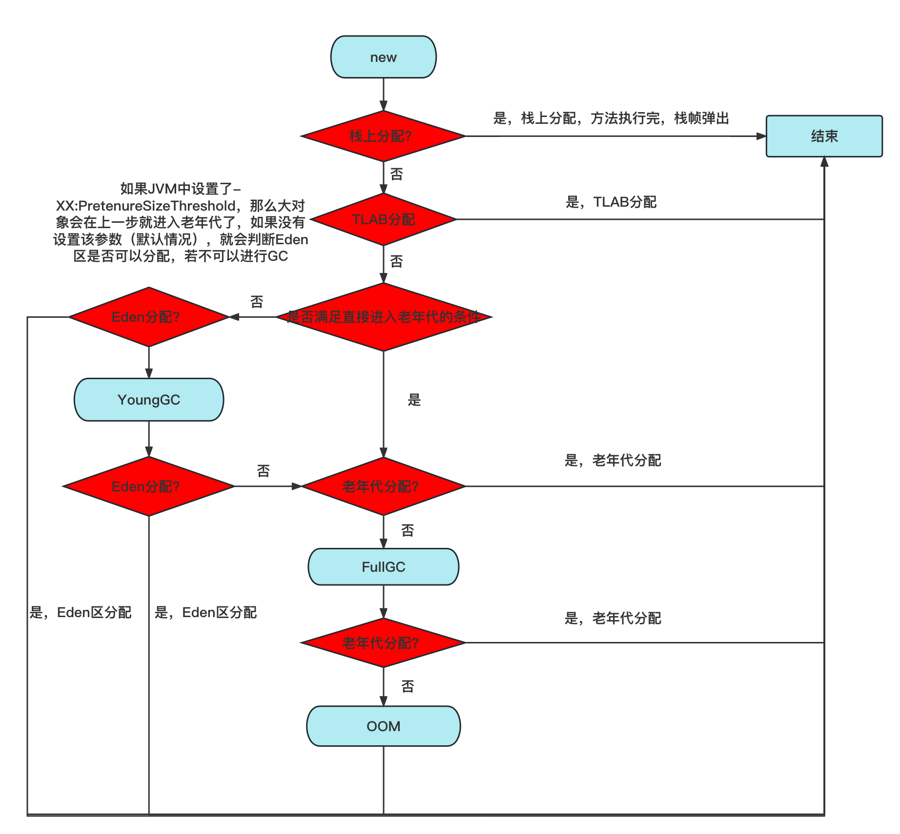
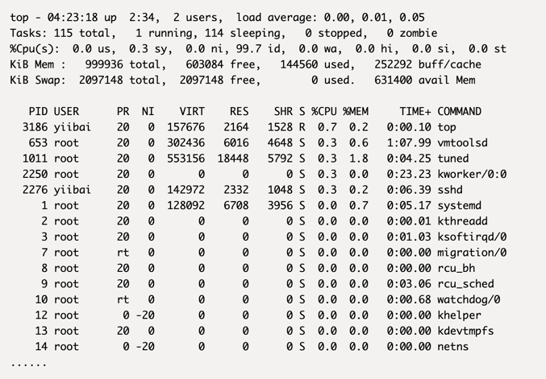
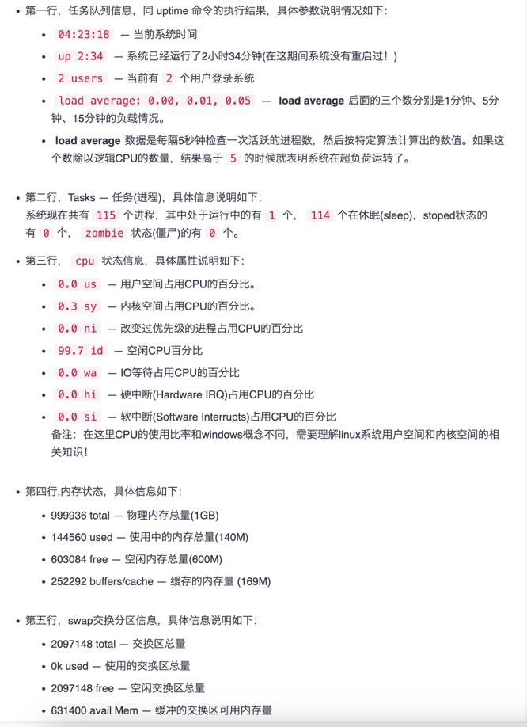

# 		JVM

## 一、内存模型

### 线程公有

#### 1.堆

几乎所有的对象实例及数组都在堆上分配，也可能出现栈上分配，经过逃逸分析可能出现标量替换等手段

##### 逃逸分析

1. 栈上分配：确定一个对象不会逃逸到线程外
2. 标量替换：确定一个对象不会被外部方法引用，并且标量可替换，简单举例 类A属性中有类B的对象
3. 同步消除（锁消除）:变量不会逃出线程，无法被其他线程访问，读写不会有竞争，同步措施就会消除

#### 2.方法区、永久代、元空间（JDK8）

1. JDK6: 类型信息、域信息、方法信息、JIT代码缓存、静态变量、运行时常量池（包含字符串常量池）
2. JDK7: 静态变量和字符串常量池转移到堆
3. JDK8: 改名为元空间，JDK8以前内存由JVM管理，JDK8由本机内存限制

### 线程私有

#### 3.Java虚拟机栈

为Java方法服务，会存放栈帧，一个栈帧，代表一个方法

栈帧




#### 4.本地方法栈

为本地的Native方法服务

#### 5.程序计数器

线程执行字节码的行号指示器，为保证线程切换后，能恢复到正确的执行位置


## 二、类加载机制


### 1.类加载过程

1 加载:通过全限定名来加载生成class对象到内存中

2 验证:验证class文件，包括文件格式校验，元数据验证，字节码校验，符号引用验证等

3 准备:为类变量分配内存，并设置初始值0，不包含static final ,在编译期就分配了，不会为实例变量分配初始化，类变量在JDK7以前在方法区,JDK7以后在堆

4 解析:常量池中的符号引用转为直接引用（符号引用就是class文件中的CONSTANT_Class_info，CONSTANT_Field_info，CONSTANT_Method_info等类型的常量）

5 初始化:执行类构造器<clinit>()方法的过程(<clinit>()方法由所有的类变量赋值动作和静态语句块合并产生)	

6 使用

7 卸载

### 2.双亲委派模型

定义

当收到类的加载请求时，不会自己去加载，请求委派给父类加载器依次向上委托，当父类加载器无法加载，才会自己尝试加载

优点

1 避免类被重复加载 

2 避免核心API被篡改 ，例如建一个java.lang包，建一个String类，JVM会用双亲委派模型加载最顶层的启动类(引导类加载器,也被称为沙箱安全机制)

### 3.类加载器



启动类加载器

加载JAVA_HOME/lib目录下java虚拟机能够识别的的jar包，名字不符合不能够加载

扩展类加载器

由ExtClassLoader实现的，它负责加载JAVA_HOME/lib/ext目录中jar包

应用程序类加载器

由AppClassLoader实现的，负责加载用户路径ClassPath上的所有类库

自定义加载器

继承 java.lang.classLoader 重写findclass方法

优点

1.隔离加载类

2.修改类加载方式

3.扩展加载源

4.防止源码泄漏

### 4.破坏双亲委派模型

1 JDK1.2之前，双亲委派机制还未发布，出现loadclass()方法，也就是双亲委派的具体实现逻辑，可能被子类覆盖，解决:在ClassLoader中添加一个新的protected findclass()方法，尽可能重写它

2.被父类加载器加载，又要调回用户代码，例如JNDI,解决:添加一个线程上下文加载器

3.代码热替换，模块热部署，将模块与加载器一起换掉，例如OSGI(open service gateway initiative),动态模型系统，实现模块化热部署的关键是它自定义的类加载机制的实现，每一个程序模块都有自己的类加载器，当需要更换模块时，将模块与加载器一起换掉

### 5.引申

#### 为什么tomcat会打破双亲委派机制

1.每个WebApp可能有不同类库，若直接加载最顶端的父类加载器，可能会导致冲突

2.WebAppClassLoader和JasperClassLoader（在WebAppClassLoader下面的一个结点）会自己加载，加载不到，再传给CommonClassLoader走双亲委派机制


举例：我们是可以把war包放到tomcat的webapp下，这意味着一个tomcat可以运行多个Web应用程序，那假设现在有两个Web应用程序，它们都有一个类，叫做User，并且它们的类全限定名都一样，比如都是com.yyy.User。但是他们的具体实现是不一样的，Tomcat给每个 Web 应用创建一个类加载器实例（WebAppClassLoader)，该加载器重写了loadClass方法，优先加载当前应用目录下的类，如果当前找不到，才一层一层往上找，这也是破坏了双亲委派机制。


## 三、对象的创建、分配、定位、内存布局、三种状态

### 1.创建对象的过程

1. 是否能在常量池中定位到类符号的引用，检查类是否被加载，解析和初始化过，若没有执行类加载过程，先执行类加载过程

2. 分配内存：

   1. 指针碰撞：堆中内存规整、连续
   2. 空闲列表：内存不规整，维护一个空闲列表，记录哪些内存可用

3. 分配内存的并发保证

   1 CAS+失败重试

   2 进行TLAB，先在Eden区中划分缓冲区，即线程本地分配缓存，是线程专用的内存分配区域

4. 初始化为0,保证对象实例字段不赋初值也可以使用
5. 设置对象头信息(锁标志,GC分代年龄,hashcode值,引用指针)
6. 执行<init>方法


### 2.内存分配

指针碰撞:用过的内存放一边，空闲的内存放另一边，分配内存，指针向空闲方向移动与对象大小相等的距离(Serial ParNew)

空闲列表: 使用过和未使用过的内存放在一起，需要维护一个列表，在列表找到足够大的内存空间分配给对象(CMS)

### 3.定位

句柄访问: 堆中划分一块内存作为句柄池，对象的引用reference存储对象的句柄地址，句柄池中有对象实例数据和到对象类型数据的指针

直接指针访问: reference存放的是对象的指针，就省了一次间接访问的开销，速度快

句柄访问优于直接指针访问在哪儿？和GC 有关系:句柄访问的对象引用reference 稳定，而直接指针不稳定

### 4.内存布局


### 5.三种状态

1. 可触及：从根节点，可到达这个对象
2. 可复活：对象的所有引用被释放，在finalize（）中复活
3. 不可触及：不可触及的和finalize（）方法中被调用过一次

​		

## 四、垃圾标记阶段算法

### 1.引用计数算法

定义：在对象中添加一个引用的计数器，每当有一个地方引用就+1，当引用失效时，就-1，当计数器为0时，被判定为可回收对象。

缺点：无法解决循环引用

### 2.可达性分析算法（GCROOTS）

定义：从被称为“GC Roots”的根对象开始，根据引用关系向下搜索如果某个对象到GC Roots间没有任何引用链相连，或者说从GC Roots到这个对象不可达时，因此它们将会被判定为可回收对象。

GC ROOTS对象：虚拟机栈中的对象，方法区的静态变量，方法区的字符串常量池的引用，本地方法栈引用对象等等

#### 并发的可达性分析

##### 三色标记法

白色：未被GC访问过，不可达

黑色：被GC访问过，所有引用都扫描过

灰色：被GC访问过，至少存在一个引用未被扫描

##### 对象消失同时满足

1 插入一条或多条从黑到白的新引用

2 删除全部从灰到白的直接或间接引用

##### 解决对象消失问题

基于1：增量更新（CMS采用）：插入新引用时，记录下来，等并发扫描结束，将记录过的引用关系的黑色对象为根，重新扫描

基于2：原始快照（G1采用）：当要删除灰色到白色的引用时，记录下来，等并发扫描结束后，将记录过的引用关系的灰色对象为根，重新扫描


## 五、垃圾回收算法

### 1.标记-清除算法

定义：标记出所有存活的对象，统一回收未被标记的对象

适用场景：对象存活较多的地方，老年代

缺点：

1.内存碎片：在标记清除之后还会产生大量不连续空间，维护一个空闲列表

2.若碎片太多，可能会提前触发一次GC

3.扫描两次：标记存活的对象，清除没有标记的对象


### 2.标记-复制算法

定义：将内存分为两块大小相等的区域，将活着的对象复制到一块，再把使用过的清理掉

适用场景：存活对象少的地方，年轻代，"朝生夕灭"

缺点：

1.需要浪费部分空间

2.扫描整个空间，扫描存活对象并复制，内存开销和时间开销都不小


### 3.标记-整理(压缩)算法

定义：标记所有存活对象，会被移动到内存空间的另一端，清理掉边界以外的内存

适用场景：一般用于老年代

缺点：移动大量对象都得导致STW（STW：GC事件发生过程中，会产生应用程序的卡顿。例如可达性分析算法中枚举根节点GC Roots会导致所有Java执行线程卡顿，因为分析工作必须在一个能确保一致性的快照中进行，如果出现分析过程中对象引用关系还在不断变化，则分析结果的准确性无法保证）


### 4.分代收集算法（结合上面三种算法）

JVM堆空间细分（Eden:s0:s1 = 8:1:1,年轻代:老年代 = 1:2，堆占物理内存1/4）


总结对象在JVM中的分配流程（第一幅图网上，第二幅图是自制的）




#### 1.年轻代用标记-复制算法

当初始加载对象时会分配在Eden区，幸存区又分为survivor from区 和survivor to 区，谁为空谁为to ，始终都会有一个区域为空，幸存区不会主动进行垃圾回收，只会Eden回收时才会附带进行gc，当在幸存区中的阈值达到了15后（默认15可修改）会自动进入老年代，当新生区（Eden）出现了内存不足时，会进行YoungGC，那么会将没有指针的对象回收，还有指针引向的对象放入survivor1或者survivor2区域中，eden清空，数据放入一个survivor中，并且阈值+1。当第二次进行gc，那么会将eden区的数据和当前survivor区中有效数据放入另一个空的survivor中，依次类推。

因为新生代每次垃圾回收都要回收大部分对象，只有少量存活的对象，只需要付出少量存活对象的复制成本就可以完成收集，所以适合使用标记-复制算法。

#### 2.老年代用标记-清除或者标记-整理算法

因为对象存活率高，所以采用标记—清除或标记—整理算法来进行回收, 不必进行内存复制, 且直接腾出空闲内存。


## 六、垃圾收集器

### CMS收集器

定义：JDK1.5发布的具有划时代意义，HotSpot虚拟机中第一次实现让垃圾收集线程与用户线程同时工作的垃圾收集器。

垃圾收集具体过程：

1.初始标记:标记GC ROOTS能直接关联到的对象,STW,速度快

2.并发标记:从直接关联的对象，遍历对象图，耗时长，并发执行

3.重新标记:并发标记期间对象引用产生变动，重新标记，STW,速度快

4.并发清理:清理掉标记阶段已经死亡的对象，耗时长，并发执行

缺点：

1.并发执行会占用部分线程，降低总吞吐量

2.无法处理浮动垃圾（在并发清理后产生的垃圾）

3.基于标记-清除算法存在大量的内存碎片

### G1收集器


定义：采用MixGC模式(不再是分代收集)，G1将堆划分为大量的Region区,Region区中含有H区(存放大对象用的),G1 HeapRegionSize为1－32MB,2的N次幂，建立可预测的停顿时间模型，基于Region回收，速度快,然后在后台维护一个优先级列表,回收垃圾的效率越高，优先级越高

垃圾收集具体过程：

1.初始标记:标记GC ROOTS能直接关联到的对象,会加一个TAMS指针,为使用户线程能够准确的在Region中分配空间,STW,速度快

2.并发标记:从直接关联的对象，遍历对象图，耗时长，并发执行,重新处理原始快照记录下有引用变动的对象

3.最终标记:处理并发标记后,仍遗留的少量原始快照记录,STW

4.筛选回收:根据用户所期望的时间进行回收,多个Region构成回收集移动到空的Region,清理旧空间,STW（本阶段原本可以变为并发执行,不迫切实现,所以放到ZGC收集器中）

优点：

1.标记复制算法（从局部的region看）和标记整理算法（从全局看）都不会产生内存碎片,不会因为分配大对象导致直接FullGC

2.可停顿的预测模型，因为它是基于region回收，可以有计划得避免整个Java堆中进行全区域的垃圾收集

缺点：无论是垃圾收集产生的内存占用还是程序运行的额外执行负载都比CMS收集器高

1.从内存占用看：将Java堆分为多个独立的region后，存在跨region引用对象问题，使用记忆集避免全堆作为GC ROOTS扫描（CMS是跨代引用，也是用记忆集去解决的），但在G1收集器上，实现要复杂很多，每个region都有自己的记忆集，记忆集会记录别的region指向自己的指针，并标记这些指针分别在哪些卡页的范围之内，G1的记忆集在存储结构的本质上就是哈希表，key是region的起始地址，value是一个存着卡表索引号的集合，region数量也比分代的数量多的多，所以内存耗费大约为Java堆容量的10%～20%

2.从执行负载看：例如G1和CMS收集器都用到了写屏障，CMS用写后屏障来维护更新卡表，G1不仅使用写后屏障，并且为了实现原始快照（STAB）搜索算法，还需要使用写前屏障来跟踪并发时指针的变化情况，相比增量更新算法，原始快照搜索能够减少并发标记和重新标记阶段的消耗，避免CMS那样在最终标记阶段停顿时间过长的缺点，但在用户程序运行过程中确实会产生由跟踪引用变化带来的额外负担。由于G1对写屏障的复杂操作要比CMS消耗更多的运算资源，所以CMS的写屏障事直接的同步操作，而G1是类似于消息队列的结构，把写前和写后屏障都放入队列里进行异步处理。


### 引申

1.可达性分析算法中的根结点枚举GC ROOTS,这一步骤必须stop the world,虽然已经可以做到和用户线程并发,但还是必须保障一致性快照中才能得以更新

2.完成枚举后，出现问题：引用关系变化或者（OOPMap）（存储对象引用关系、偏移量等指令）非常多，如果每一条指令都去存储，需要大量的存储空间，所以在特定位置记录这些信息，这些位置就是安全点（以是否具有让程序长时间执行的特征选定，如方法调用，循环跳转，异常跳转等）

3.到了安全点以后怎么停下来：1 抢先式中断（不需要代码配合，直接中断，已经不采用了）。2 主动式中断，不对线程操作，设置一个标志位，不停去轮询它，一旦发现为真，主动中断挂起，轮询的标志位和安全点是重合的，还有创建对象为其对分配内存的地方，这是为了检查是否发生GC，避免没有内存分配对象

4.安全区域:若程序不执行或者sleep状态,无法响应JVM中断请求，找出一段代码，确保引用关系不会发生变化，在这区域的任何地方收集都是安全的

5.为了解决跨代引用的问题，垃圾收集器在新生代中建立了名叫"记忆集"的数据结构，只需要通过记忆集来判断某块非收集区域是否有指向收集区域的指针即可（不用扫描老年代），“卡表”是记忆集的具体实现，定义了记忆集的精度，与堆内存的映射关系。简单的说，它就是一个字节数组，每个元素对应的标识区域叫“卡页”，默认512字节，只要卡页存在跨代指针，将对应的元素值置1，也可以称这个元素变脏，没有，则标识为0

6.那怎么去变脏呢？谁去维护变脏的步骤？引入“写屏障”，在引用对象进行赋值，会产生一个环形通知，赋值前的叫写前屏障，赋值后的叫写后屏障（基于虚拟机层面）

7.卡表在高并发环境下还存在伪共享问题，解决：先检查卡表标记，当卡表未被标记，将其变脏

卡表：

CMS：只需要一份卡表，那就是老年代到新生代

G1：G1卡表比CMS更复杂，每个Region一份卡表,可能占据堆容量的20%

写屏障：

CMS：用写后屏障维护卡表,是直接同步的操作

G1：用写后屏障和写前屏障,类似把它们放入消息队列，作异步处理（写前屏障跟踪并发时指针变化情况），详细可查看上文“G1收集器”章节


## 七、四大引用

1. 强引用：就算出现OOM也不会对对象回收
2. 软引用：内存够用就保留，不够用就回收
3. 弱引用：无论内存够不够，只要有GC就回收
4. 虚引用：任何时候都有可能被回收，无法通过虚引用取得对象实例

引申：

1.软引用设计场景：若一个应用需要读取大量本地图片，每次都硬盘读取影响性能，一次性加载，容易内存溢出

解决：用一个HashMap保存图片路径和图片对象关系的软引用，回收缓存图片对象占用的空间，避免OOM

Map<String,SoftReference<BitMap>> imagecache = new HashMap<SoftReference<BitMap>>();

2.弱引用在GC时，进入到引用队列ReferenceQueue，遍历这个队列进行删除

3.虚引用必须和引用队列一起使用，确保被finalize（）以后，还能做一些事，类似监控


## 八、调优

### 1.YoungGC和FullGC触发条件

YoungGC：Eden区满

FullGC：1.老年代空间不足  2.永久代空间不足  3.system.gc()可能触发FullGC

### 2.CPU飙高100%排查（thread dump）

出现的情况：

1.出现死循环：会调用cpu寄存器进行计数，此操作将占用CPU资源，那么线程始终处于无限循环状态，除非操作系统的时间片到期，否则不会放弃占用CPU资源，并且继续循环地向操作系统请求时间片，直到系统没有空闲时间来执行任何其他操作

2.频繁的YoungGC：YoungGC就是JVM用于垃圾收集的操作，需要计算内存和调用寄存器，因此频繁GC会占用CPU资源

3.产生大量的运行（Running和Runnable）的线程（BLOACKED和WAITING状态占用很少的cpu）

解决：

1.top -c 得到cpu占用高的进程pid

2.top -Hp pid 得到进程中占用cpu高的线程tid

3.jstack pid > test.txt,导出进程的堆栈信息的快照

4.vim工具进入test.txt,或者用 cat test.txt |grep 'b26' -C 8 (pid是十进制的，而堆栈信息里的都是十六进制的，所以需要把tid转为十六进制即print "%x\n" tid)

或者可以借助一些工具去看，例如https://fastthread.io/,  直接将txt文件上传就可以了，可以清晰地看到线程各个状态的数量，GC线程，OOM，死锁情况等等，或者使用jstat pid >test.txt导出gc信息

### 3.内存泄漏排查（heap dump）

  1.导出heap dump文件的命令 jmap  -dump：format=b，file=heap.hprof  pid （format=b 代表bin格式）

  2.打开https://heaphero.io/工具，打开large object，就可以看到各个对象占用内存的基本情况了

  3.例: java -jar -Xms12g -Xmx12g -XX:+HeapDumpOnOutOfMemoryError -XX:HeapDumpPath=/home/work/heap.hprof  xxx.jar

### 4.OOM

1.StackOverFlow:栈溢出（可能是因为递归调用导致）

2.Java heap space：堆溢出

3.MetaSpace（默认208M），类元信息，利用cglib中的Enhance动态生成类

4.GC over head limit exceeded：GC开销过大，98%的时间回收不到2%的内存。场景：while（true）{list.add（String.valueOf(i++).intern()）;}

5.Direct buffer momory:NIO中，ByteBuffer.allowcateDirect（capacity）

6.Unable to create new native thread：创建了太多线程，Linux单个进程创建的线程在1024个

解决：1 在代码中减少线程，或者使用线程池（推荐）  2 修改Linux配置： /etc/security/limits.d/90-nproc.conf

### 5.调优基本思路和原则

1. 堆的初始最小值-Xms和最大值-Xmx设置为相同的值，防止堆收缩产生额外的时间和性能消耗
2. 调整年轻代和老年代的比例，或者针对某个代进行设置绝对大小，防止年轻代或者老年代收缩 -XX：newSize -XX:maxnewSize
3. 观察应用是否存在大量临时对象，如果是，适当增大年轻代
4. 在其他峰值时，看老年代占多少内存，若不影响，加大年轻代，比如可以控制在1：1
5. 配置好的机器（多核，大内存），用并发收集算法
6. 线程堆栈的设置，每个线程默认开启1M的线程栈，太多了，512k足矣，减少每个线程的线程栈，可以产生更多线程
7. 原则：减少GC次数，STW

### 6.Linux常用命令

查看系统负载：

top：



uptime：  查看系统负载的情况，也就是top的第一行信息

CPU：vmstat 2 5（每2秒执行一次，执行5次）

内存：free -h，硬盘： df -h

### 7.JVM常用参数

-Xms：堆初始内存（物理内存1/64）

-Xmx：堆最大内存（物理内存1/4）

-Xss：（Thread stacksize）单个线程栈大小，默认是0，代表1MB

-Xmn：年轻代大小，默认1/3 堆空间

-XX：MetaSpaceSize：无空间（受本地内存大小限制，16G MetaSpaceSize为21M，调整 -XX：MetaSpaceSize=1024M）

-XX：+PrintGCDetails ，打印GC回收细节

-XX：SurvivorRatio（默认为8，Eden：s0：s1=8:1:1） 若-XX：SurvivorRatio=4，则4:1:1

-XX：NewRatio:年轻代与老年代的比例（默认为2，若-XX：NewRatio=4，则年轻代与老年代的比例为1:4）

-XX：MaxTenuringThreshold：垃圾晋升老年代的最大年龄（默认15岁，必须在0~15）

-XX：+PrintFlagsInitial 初始参数

-XX：+PrintCommandLineFlags 打印JVM执行参数的细节

例：-Xms 4096m -Xmx 4096m -Xss:1024k -XX:MetaSpaceSize=512m -XX:+PrintCommandLineFlags -XX:+UseParallelGC

常用命令如下：

1.jstack pid > test.txt 导出thread dump文件

2.jmap  -dump：format=b，file=heap.hprof  pid 导出heap dump文件

3.jmap -heap pid可以查看pid的堆的具体信息

4.java -XX:+PrintCommandLineFlags  -version可以查看基本信息

5.jinfo pid 可以查看详情，类似第4点的PrintCommandLineFlags

6.jinfo -flag ThreadStackSize pid 查看线程栈的大小

7.java -XX:+PrintGCDetails 可以查看GC情况

8.jstat -gcutil pid 1000，可以每1000毫秒输出一次gc信息

9.jstat -gc pid 垃圾回收统计

10.jstat -gccapacity pid 堆内存统计,参考https://www.jianshu.com/p/845924a1b8f2

11.运行Java程序时添加以下参数以输出gc日志 `-XX:+PrintGCDetails` `-XX:+PrintGCTimeStamps` `-XX:+PrintGCDateStamps` `-XX:+PrintHeapAtGC` `-verbose:gc` `-XX:+PrintTenuringDistribution` `-XX:+PrintGCApplicationStoppedTime` `-Xloggc:/tmp/gc.log`，然后打开https://gceasy.io/，将gc信息上传即可分析gc日志进行调优

### 8.G1参数

1. -XX：UseG1GC
2. -XX：G1HeapRegionSize=n（Region大小，1~32M,2的n次幂）
3. -XX：MaxGCPausemills=n，最大停顿时间
4. -XX：InitialHeapOccupancyPercent=n；堆占用多少触发GC，默认45
5. -XX：ConcGCThreads=n，并发GC使用线程数
6. -XX：G1ReservePercent=n，空闲空间预留内存百分比，降低溢出风险，默认10%


## 九、思考

### 1.内存分配担保机制？

在发生MinorGC前检查，老年代最大可用连续空间是否大于新生代总空间

大于则MinorGC安全，小于则查看担保的参数HandlePromotionFailure（JDK7以后默认为true，避免频繁FullGC）

true:检查老年代最大可用连续空间，与即将晋级老年代对象的平均大小

false:进行FullGC

### 2.对象进入老年代的几种情况？

1.存活对象达到年龄阈值（默认为15）

2.大对象直接进入老年代（超过了JVM中-XX:PretenureSizeThreshold参数的设置，默认值是0，意味着任何对象都会先在新生代分配内存），所以在写程序的时候要尽量避免大对象，更要尽量避免朝生夕死的大对象，经常出现大对象容易导致内存还有不少空间时就提前触发垃圾收集以获取足够的连续空间来安置他们

3.通过动态年龄判断机制，survivor区中如果有相同年龄的对象所占空间大于幸存者区的一半，那么大于等于该年龄的对象就可以直接进入老年代

4.YoungGC后，Survivor区空间不能容纳全部存活对象，所有对象直接进入老年代	

### 3.永久代为什么被元空间替代？

1.永久代设置空间大小很难确定，容易产生OOM，例如一个Web工程，功能很多，不断加载很多类，出现致命错误，而元空间在本地内存中，受本地内存限制

2.调优困难，回收不再使用的废弃常量（相对简单），回收不再使用的类元信息（非常麻烦）

### 4.StringTable 字符串常量池为什么要调整到堆中？

永久代回收效率低，FullGC才会触发回收，开发中会创建大量字符串，导致永久代的OOM

### 5.为什么堆内存超过32G，压缩指针会失效？

压缩指针的概念：不再保存所有引用，而是每隔8个字节保存一个引用。例如，原来保存每个引用0、1、2…，现在只保存0、8、16…。因此，指针压缩后，并不是所有引用都保存在堆中，而是以8个字节为间隔保存引用，可参考https://www.jianshu.com/p/d6100e8b5745

64位JVM会比32位JVM多用1.5倍内存(具体的原因在后面详述)，在64位中，对象指针会翻倍，JDK6推出压缩指针，配置的参数-XX：+CompressedOOps，会压缩静态变量，对象指针等，32位最多4G内存，64位为堆的基地址+偏移量，偏移量/8 保存到32位地址中，即偏移量 /8 <=4 即小于32G，换个角度，寄存器中2的32次方（还需要右移3位）只能寻址到32g左右，所以当内存超过32G，jvm默认停用压缩指针，这样能保证能寻址到所有内存。

多用1.5倍内存的原因：

```java
class A{
    int a;//基本类型
    B b;//引用类型
}
```

32位：

对象头8字节+int类型4字节+引用类型4字节+补充0字节=16个字节

64位不开启压缩指针（2倍）

对象头16字节+int类型4字节+引用类型8字节+补充4字节=32个字节

64位开启压缩指针（1.5倍）

对象头12字节+int类型4字节+引用类型4字节+补充0字节=24个字节

开启后可以减缓堆空间的压力(同样的内存更不容易发生oom)

### 6.JVM中的进程和操作系统的线程是一样吗？

在jdk1.2之前，Java 线程是基于称为 "绿色线程"（Green Threads）的用户级线程实现的，也就是说程序员为 JVM 开发了自己的一套线程库或者说线程管理机制

在jdk1.2以及之后，JVM选择使用操作系统原生的线程模型，将线程交给操作系统内核进行调度，本质上Java的线程就是操作系统里的线程，而对于不同的操作系统来说，它们各自对于线程的设计也都是不同的，比如Linux下是基于pthread库实现的轻量级进程，Windows下是原生的系统Win32 API提供系统调用从而实现多线程，所以 JVM 中明确声明：虚拟机中的线程状态不反应任何操作系统中的线程状态。

### 7.操作系统中进程和线程的区别是什么？

进程是系统进行资源调度和分配的的基本单位，实现了操作系统的并发

线程是进程的子任务，是CPU调度和分派的基本单位，实现进程内部的并发；线程是操作系统可识别的最小执行和调度单位

1.一个线程只能属于一个进程，而一个进程可以有多个线程

2.进程在执行过程中拥有独立的内存单元，而多个线程共享进程的内存

3.进程是资源分配的最小单位，线程是CPU调度的最小单位

4.系统开销方面：在创建或撤消进程时，系统都要为之分配或回收资源，如内存空间、I／o设备等，因此操作系统所付出的开销将显著地大于在创建或撤消线程时的开销。在进行进程切换时，不仅要保存当前进程cpu的环境，还要设置被调度运行的cpu环境，而线程切换只保存和设置少量寄存器的内容。进程切换的开销也远大于线程切换的开销

5.通信方面：由于同一进程中的多个线程具有相同的地址空间，线程间可以直接读写进程数据段（如全局变量）来进行通信。进程间通信就是IPC通信，在内核中开辟一块缓冲区，进程1把数据从用户空间拷到内核缓冲区，进程2再从内核缓冲区把数据读走，内核提供的这种机制称为进程间通信。


### 8.操作系统线程之间以及进程之间是如何通信的？

线程：

1.Object类提供的wait notify，配合synchronized

2.ReentrantLock结合condition.await signal

3.volatile

4.CountDownLatch

5.CyclicBarrier

6.LockSupport的park和unpark（唤醒）

进程：

1.管道通信

2.消息队列

3.共享内存

4.信号量

5.信号

6.套接字

详细可参考 https://www.jianshu.com/p/c1015f5ffa74

### 9.Linux操作系统一个进程最多创建多少个线程？

32位系统：2的32次方就是4G，内核空间占用1G，用户空间只有 3G，假设一个线程需要占用10M的栈空间，那么一个进程最多只能创建 300 个左右的线程；

64位系统：意味着用户空间达到最大值128T，依旧是假设栈占用10M，就是128T/10M，上千万个线程，其实还是会有限制的，取决于几个配置文件的/proc/sys/kernel/threads-max，/proc/sys/kernel/pid_max，/proc/sys/vm/max_map_count,并且取决于CPU的瓶颈，一般64位2G的机器可以创建2万多个线程，（此时虚拟内存已经占用20T+了，因为虚拟内存并不是全部都映射到物理内存的，程序是有局部性的特性，也就是某一个时间只会执行部分代码，所以只需要映射这部分程序就好，其实真实的物理内存只占用到400M+）


### 10.JVM默认线程栈-Xss默认为1MB，而系统的stack size为8096K，到底以哪个为准或者区别是什么？（需要验证到底是以哪个为准，写个demo）

终端输入ulimit -s或者ulimit -a，显示8096k

参考（https://segmentfault.com/a/1190000020802783）


# MySQL


