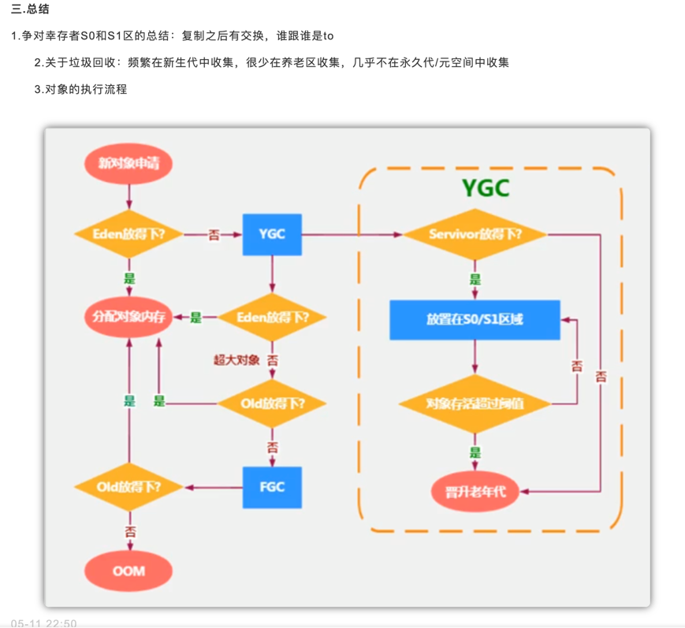

# JVM

## 一、内存模型

### 线程公有

#### 1.堆

几乎所有的对象实例及数组都在堆上分配，也可能出现栈上分配，经过逃逸分析可能出现标量替换等手段

##### 逃逸分析

1. 栈上分配：确定一个对象不会逃逸到线程外
2. 标量替换：确定一个对象不会被外部方法引用，并且标量可替换，简单举例 类A属性中有类B的对象
3. 同步消除（锁消除）:变量不会逃出线程，无法被其他线程访问，读写不会有竞争，同步措施就会消除

#### 2.方法区

1. JDK6: 类型信息、域信息、方法信息、JIT代码缓存、静态变量、运行时常量池（包含字符串常量池）
2. JDK7: 静态变量和字符串常量池转移到堆
3. JDK8: 改名为元空间，JDK8以前内存由JVM管理，JDK8由本机内存限制

### 线程私有

#### 3.Java虚拟机栈

为Java方法服务，会存放栈帧，一个栈帧，代表一个方法

栈帧

#### 4.本地方法栈

为本地的Native方法服务

#### 5.程序计数器

线程执行字节码的行号指示器，为保证线程切换后，能恢复到正确的执行位置

## 二、类加载机制

### 1.类加载过程

1 加载:通过全限定名来加载生成class对象到内存中

2 验证:验证class文件，包括文件格式校验，元数据验证，字节码校验，符号引用验证等

3 准备:为类变量分配内存，并设置初始值0，不包含static final ,在编译期就分配了，不会为实例变量分配初始化，类变量在JDK7以前在方法区,JDK7以后在堆

4 解析:常量池中的符号引用转为直接引用（符号引用就是class文件中的CONSTANT_Class_info，CONSTANT_Field_info，CONSTANT_Method_info等类型的常量）

5 初始化:执行类构造器<clinit>()方法的过程(<clinit>()方法由所有的类变量赋值动作和静态语句块合并产生)	

6 使用

7 卸载

### 2.双亲委派模型

定义

当收到类的加载请求时，不会自己去加载，请求委派给父类加载器依次向上委托，当父类加载器无法加载，才会自己尝试加载

优点

1 避免类被重复加载 

2 避免核心API被篡改 ，例如建一个java.lang包，建一个String类，JVM会用双亲委派模型加载最顶层的启动类(引导类加载器,也被称为沙箱安全机制)

### 3.类加载器

启动类加载器

加载JAVA_HOME/lib目录下java虚拟机能够识别的的jar包，名字不符合不能够加载

扩展类加载器

由ExtClassLoader实现的，它负责加载JAVA_HOME/lib/ext目录中jar包

应用程序类加载器

由AppClassLoader实现的，负责加载用户路径ClassPath上的所有类库

自定义加载器

继承 java.lang.classLoader 重写findclass方法

优点

1.隔离加载类

2.修改类加载方式

3.扩展加载源

4.防止源码泄漏

### 4.破坏双亲委派模型

1 JDK1.2之前，双亲委派机制还未发布，出现loadclass()方法，也就是双亲委派的具体实现逻辑，可能被子类覆盖，解决:在ClassLoader中添加一个新的protected findclass()方法，尽可能重写它

2.被父类加载器加载，又要调回用户代码，例如JNDI,解决:添加一个线程上下文加载器

3.代码热替换，模块热部署，将模块与加载器一起换掉，例如OSGI(open service gateway initiative),动态模型系统，实现模块化热部署的关键是它自定义的类加载机制的实现，每一个程序模块都有自己的类加载器，当需要更换模块时，将模块与加载器一起换掉

### 5.引申

#### 为什么tomcat会打破双亲委派机制

1.每个WebApp可能有不同类库，若直接加载最顶端的父类加载器，可能会导致冲突

2.WebAppClassLoader和JasperClassLoader（在WebAppClassLoader下面的一个结点）会自己加载，加载不到，再传给CommonClassLoader走双亲委派机制

举例：我们是可以把war包放到tomcat的webapp下，这意味着一个tomcat可以运行多个Web应用程序，那假设现在有两个Web应用程序，它们都有一个类，叫做User，并且它们的类全限定名都一样，比如都是com.yyy.User。但是他们的具体实现是不一样的，Tomcat给每个 Web 应用创建一个类加载器实例（WebAppClassLoader)，该加载器重写了loadClass方法，优先加载当前应用目录下的类，如果当前找不到了，才一层一层往上找，这也是破坏了双亲委派机制。

## 三、对象的创建、分配、定位、内存布局、三种状态

### 1.创建对象的过程

1. 是否能在常量池中定位到类符号的引用，检查类是否被加载，解析和初始化过，若没有执行类加载过程，先执行类加载过程

2. 分配内存：

   1. 指针碰撞：堆中内存规整、连续
   2. 空闲列表：内存不规整，维护一个空闲列表，记录哪些内存可用

3. 分配内存的并发保证

   1 CAS+失败重试

   2 进行TLAB，先在堆中划分缓冲区

4. 初始化为0,保证对象实例字段不赋初值也可以使用
5. 设置对象头信息(锁标志,GC分代年龄,hashcode值,引用指针)
6. 执行<init>方法

### 2.内存分配

指针碰撞:用过的内存放一边，空闲的内存放另一边，分配内存，指针向空闲方向移动与对象大小相等的距离(Serial ParNew)

空闲列表: 使用过和未使用过的内存放在一起，需要维护一个列表，在列表找到足够大的内存空间分配给对象(CMS)

### 3.定位

句柄访问: 堆中划分一块内存作为句柄池，对象的引用reference存储对象的句柄地址，句柄池中有对象实例数据和到对象类型数据的指针

直接指针访问: reference存放的是对象的指针，就省了一次间接访问的开销，速度快

句柄访问优于直接指针访问在哪儿？和GC 有关系:句柄访问的对象引用reference 稳定，而直接指针不稳定

### 4.内存布局

### 5.三种状态

1. 可触及：从根节点，可到达这个对象
2. 可复活：对象的所有引用被释放，在finalize（）中复活
3. 不可触及：不可触及的和finalize（）方法中被调用过一次

​		

## 四、垃圾标记阶段算法

### 1.引用计数算法

定义：在对象中添加一个引用的计数器，每当有一个地方引用就+1，当引用失效时，就-1，当计数器为0时，被判定为可回收对象。

缺点：无法解决循环引用

### 2.可达性分析算法（GCROOTS）

定义：从被称为“GC Roots”的根对象开始，根据引用关系向下搜索如果某个对象到GC Roots间没有任何引用链相连，或者说从GC Roots到这个对象不可达时，因此它们将会被判定为可回收对象。

GC ROOTS对象：虚拟机栈中的对象，方法区的静态变量，方法区的字符串常量池的引用，本地方法栈引用对象等等

#### 并发的可达性分析

##### 三色标记法

白色：未被GC访问过，不可达

黑色：被GC访问过，所有引用都扫描过

灰色：被GC访问过，至少存在一个引用未被扫描

##### 对象消失同时满足

1 插入一条或多条从黑到白的新引用

2 删除全部从灰到白的直接或间接引用

##### 解决对象消失问题

基于1：增量更新：插入新引用时，记录下来，等并发扫描结束，将记录过的引用关系的黑色对象为根，重新扫描

基于2：原始快照：当要删除灰色到白色的引用时，记录下来，等并发扫描结束后，将记录过的引用关系的灰色对象为根，重新扫描

## 五、垃圾回收算法

### 1.标记-清除算法

定义：标记出所有存活的对象，统一回收未被标记的对象

适用场景：对象存活较多的地方，老年代

缺点：

1.内存碎片：在标记清除之后还会产生大量不连续空间，维护一个空闲列表

2.若碎片太多，可能会提前触发一次GC

3.扫描两次：标记存活的对象，清除没有标记的对象

### 2.标记-复制算法

定义：将内存分为两块大小相等的区域，将活着的对象复制到一块，再把使用过的清理掉

适用场景：存活对象少的地方，年轻代，"朝生夕灭"

缺点：

1.需要浪费部分空间

2.扫描整个空间，扫描存活对象并复制，内存开销和时间开销都不小

### 3.标记-整理(压缩)算法

定义：标记所有存活对象，会被移动到内存空间的另一端，清理掉边界以外的内存

适用场景：一般用于老年代

缺点：移动大量对象都得导致STW（STW：GC事件发生过程中，会产生应用程序的卡顿。例如可达性分析算法中枚举根节点GC Roots会导致所有Java执行线程卡顿，因为分析工作必须在一个能确保一致性的快照中进行，如果出现分析过程中对象引用关系还在不断变化，则分析结果的准确性无法保证）

### 4.分代收集算法（结合上面三种算法）

JVM堆空间细分（Eden:s0:s1 = 8:1:1,年轻代:老年代 = 1:2，堆占物理内存1/4）

总结对象执行流程

#### 1.年轻代用标记-复制算法

当初始加载对象时会分配在Eden区，幸存区又分为survivor from区 和survivor to 区，谁为空谁为to ，始终都会有一个区域为空，幸存区不会主动进行垃圾回收，只会Eden回收时才会附带进行gc，当在幸存区中的阈值达到了15后（默认15可修改）会自动进入老年代，当新生区（Eden）出现了内存不足时，会进行YoungGC，那么会将没有指针的对象回收，还有指针引向的对象放入survivor1或者survivor2区域中，eden清空，数据放入一个survivor中，并且阈值+1。当第二次进行gc，那么会将eden区的数据和当前survivor区中有效数据放入另一个空的survivor中，依次类推。

因为新生代每次垃圾回收都要回收大部分对象，只有少量存活的对象，只需要付出少量存活对象的复制成本就可以完成收集，所以适合使用标记-复制算法。

#### 2.老年代用标记-清除或者标记-整理算法

因为对象存活率高，所以采用标记—清除或标记—整理算法来进行回收, 不必进行内存复制, 且直接腾出空闲内存。

## 六、垃圾收集器

### CMS收集器

定义：JDK1.5发布的具有划时代意义，HotSpot虚拟机中第一次实现让垃圾收集线程与用户线程同时工作的垃圾收集器

垃圾收集具体过程：

1.初始标记:标记GC ROOTS能直接关联到的对象,STW,速度快

2.并发标记:从直接关联的对象，遍历对象图，耗时长，并发执行

3.重新标记:并发标记期间对象引用产生变动，重新标记，STW,速度快

4.并发清理:清理掉标记阶段已经死亡的对象，耗时长，并发执行

缺点：

1.并发执行会占用部分线程，降低总吞吐量

2.无法处理浮动垃圾（在并发清理后产生的垃圾）

3.基于标记-清除算法存在大量的内存碎片

### G1收集器

定义：采用MixGC模式(不再是分代收集)，G1将堆划分为大量的Region区,Region区中含有H区(存放大对象用的),G1 HeapRegionSize为1－32MB,2的N次幂，建立可预测的停顿时间模型，基于Region回收，速度快,然后在后台维护一个优先级列表,回收垃圾的效率越高，优先级越高

垃圾收集具体过程：

1.初始标记:标记GC ROOTS能直接关联到的对象,会加一个TAMS指针,为使用户线程能够准确的在Region中分配空间,STW,速度快

2.并发标记:从直接关联的对象，遍历对象图，耗时长，并发执行,重新处理原始快照记录下有引用变动的对象

3.最终标记:处理并发标记后,仍遗留的少量原始快照记录,STW

4.筛选回收:根据用户所期望的时间进行回收,多个Region构成回收集移动到空的Region,清理旧空间,STW（本阶段原本可以变为并发执行,不迫切实现,所以放到ZGC收集器中）

优点：

1.标记复制算法（从局部的region看）和标记整理算法（从全局看）都不会产生内存碎片,不会因为分配大对象导致直接FullGC

2.可停顿的预测模型，因为它是基于region回收，可以有计划得避免整个Java堆中进行全区域的垃圾收集

缺点：无论是垃圾收集产生的内存占用还是程序运行的额外执行负载都比CMS收集器高

1.从内存占用看：将Java堆分为多个独立的region后，存在跨region引用对象问题，使用记忆集避免全堆作为GC ROOTS扫描（CMS是跨代引用，也是用记忆集去解决的），但在G1收集器上，实现要复杂很多，每个region都有自己的记忆集，记忆集会记录别的region指向自己的指针，并标记这些指针分别在哪些卡页的范围之内，G1的记忆集在存储结构的本质上就是哈希表，key是region的起始地址，value是一个存着卡表索引号的集合，region数量也比分代的数量多的多，所以内存耗费大约为Java堆容量的10%～20%

2.从执行负载看：例如G1和CMS收集器都用到了写屏障，CMS用写后屏障来维护更新卡表，G1不仅使用写后屏障，并且为了实现原始快照（STAB）搜索算法，还需要使用写前屏障来跟踪并发时指针的变化情况，相比增量更新算法，原始快照搜索能够减少并发标记和重新标记阶段的消耗，避免CMS那样在最终标记阶段停顿时间过长的缺点，但在用户程序运行过程中确实会产生由跟踪引用变化带来的额外负担。由于G1对写屏障的复杂操作要比CMS消耗更多的运算资源，所以CMS的写屏障事直接的同步操作，而G1是类似于消息队列的结构，把写前和写后屏障都放入队列里进行异步处理。

### 引申

1.可达性分析算法中的根结点枚举GC ROOTS,这一步骤必须stop the world,虽然已经可以做到和用户线程并发,但还是必须保障一致性快照中才能得以更新

2.

