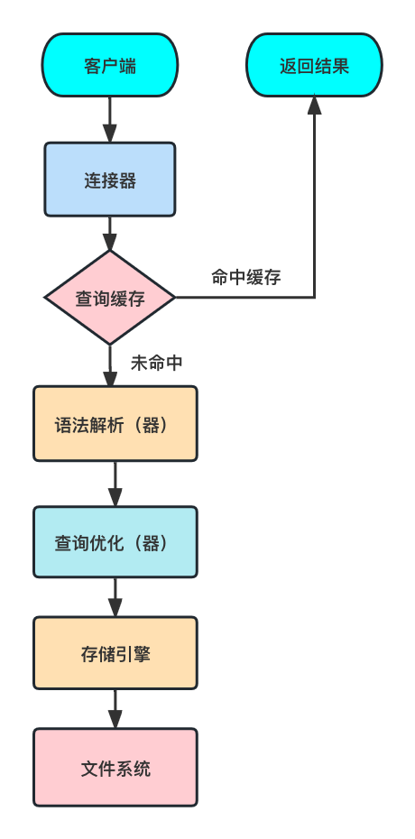
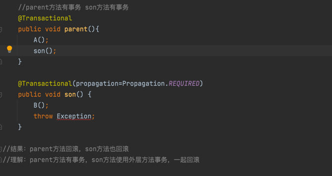
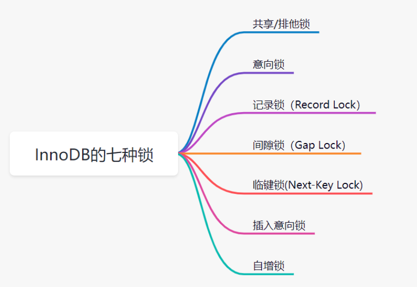

# 	JVM

## 一、内存模型

### 线程公有

#### 1.堆

几乎所有的对象实例及数组都在堆上分配，也可能出现栈上分配，经过逃逸分析可能出现标量替换等手段

##### 逃逸分析

1. 栈上分配：确定一个对象不会逃逸到线程外
2. 标量替换：确定一个对象不会被外部方法引用，并且标量可替换，简单举例 类A属性中有类B的对象
3. 同步消除（锁消除）:变量不会逃出线程，无法被其他线程访问，读写不会有竞争，同步措施就会消除

#### 2.方法区、永久代、元空间（JDK8）

1. JDK6: 类型信息、域信息、方法信息、JIT代码缓存、静态变量、运行时常量池（包含字符串常量池）
2. JDK7: 静态变量和字符串常量池转移到堆
3. JDK8: 改名为元空间，JDK8以前内存由JVM管理，JDK8由本机内存限制

### 线程私有

#### 3.Java虚拟机栈

为Java方法服务，会存放栈帧，一个栈帧，代表一个方法

栈帧


#### 4.本地方法栈

为本地的Native方法服务

#### 5.程序计数器

线程执行字节码的行号指示器，为保证线程切换后，能恢复到正确的执行位置


## 二、类加载机制


### 1.类加载过程

1 加载:通过全限定名来加载生成class对象到内存中
2 验证:验证class文件，包括文件格式校验，元数据验证，字节码校验，符号引用验证等
3 准备:为类变量分配内存，并设置初始值0，不包含static final ,在编译期就分配了，不会为实例变量分配初始化，类变量在JDK7以前在方法区,JDK7以后在堆
4 解析:常量池中的符号引用转为直接引用（符号引用是class文件中的CONSTANT_Class_info，CONSTANT_Field_info，CONSTANT_Method_info类型的常量）
5 初始化:执行类构造器<clinit>()方法的过程(<clinit>()方法由所有的类变量赋值动作和静态语句块合并产生)	
6 使用
7 卸载

### 2.双亲委派模型

定义：当收到类的加载请求时，不会自己去加载，请求委派给父类加载器依次向上委托，当父类加载器无法加载，才会自己尝试加载
优点：
1 避免类被重复加载
2 避免核心API被篡改 ，例如建一个java.lang包，建一个String类，JVM会用双亲委派模型加载最顶层的启动类(引导类加载器,也被称为沙箱安全机制)

### 3.类加载器


启动类加载器
加载JAVA_HOME/lib目录下java虚拟机能够识别的jar包，名字不符合不能够加载

扩展类加载器
由ExtClassLoader实现的，它负责加载JAVA_HOME/lib/ext目录中jar包

应用程序类加载器
由AppClassLoader实现的，负责加载用户路径ClassPath上的所有类库

自定义加载器
继承 java.lang.classLoader 重写findclass方法

优点：
1.隔离加载类
2.修改类加载方式
3.扩展加载源
4.防止源码泄漏

### 4.破坏双亲委派模型

1 JDK1.2之前，双亲委派机制还未发布，出现loadclass()方法，也就是双亲委派的具体实现逻辑，可能被子类覆盖，解决:在ClassLoader中添加一个新的protected findclass()方法，尽可能重写它
2.被父类加载器加载，又要调回用户代码，例如JNDI,解决:添加一个线程上下文加载器
3.代码热替换，模块热部署，将模块与加载器一起换掉，例如OSGI(open service gateway initiative),动态模型系统，实现模块化热部署的关键是它自定义的类加载机制的实现，每一个程序模块都有自己的类加载器，当需要更换模块时，将模块与加载器一起换掉

### 5.引申

#### 为什么tomcat会打破双亲委派机制

1.每个WebApp可能有不同类库，若直接加载最顶端的父类加载器，可能会导致冲突
2.WebAppClassLoader和JasperClassLoader（在WebAppClassLoader下面的一个结点）会自己加载，加载不到，再传给CommonClassLoader走双亲委派机制


举例：我们是可以把war包放到tomcat的webapp下，这意味着一个tomcat可以运行多个Web应用程序，那假设现在有两个Web应用程序，它们都有一个类，叫做User，并且它们的类全限定名都一样，比如都是com.yyy.User。但是他们的具体实现是不一样的，Tomcat给每个 Web 应用创建一个类加载器实例（WebAppClassLoader)，该加载器重写了loadClass方法，优先加载当前应用目录下的类，如果当前找不到，才一层一层往上找，这也是破坏了双亲委派机制。


## 三、对象的创建、分配、定位、内存布局、三种状态

### 1.创建对象的过程

1. 是否能在常量池中定位到类符号的引用，检查类是否被加载，解析和初始化过，若没有执行类加载过程，先执行类加载过程

2. 分配内存：

   1. 指针碰撞：堆中内存规整、连续
   2. 空闲列表：内存不规整，维护一个空闲列表，记录哪些内存可用

3. 分配内存的并发保证

   1.CAS+失败重试

   2.进行TLAB，先在Eden区中划分缓冲区，即线程本地分配缓存，是线程专用的内存分配区域

4. 初始化为0,保证对象实例字段不赋初值也可以使用
5. 设置对象头信息(锁标志,GC分代年龄,hashcode值,引用指针)
6. 执行<init>方法


### 2.内存分配

指针碰撞: 用过的内存放一边，空闲的内存放另一边，分配内存，指针向空闲方向移动与对象大小相等的距离(Serial ParNew)
空闲列表: 使用过和未使用过的内存放在一起，需要维护一个列表，在列表找到足够大的内存空间分配给对象(CMS)

### 3.定位

句柄访问: 堆中划分一块内存作为句柄池，对象的引用reference存储对象的句柄地址，句柄池中有对象实例数据和到对象类型数据的指针
直接指针访问: reference存放的是对象的指针，就省了一次间接访问的开销，速度快
句柄访问优于直接指针访问在哪儿？和GC 有关系:句柄访问的对象引用reference 稳定，而直接指针不稳定

### 4.内存布局


### 5.三种状态

1.可触及：从根节点，可到达这个对象
2.可复活：对象的所有引用被释放，在finalize（）中复活
3.不可触及：不可触及的和finalize（）方法中被调用过一次

​		

## 四、垃圾标记阶段算法

### 1.引用计数算法

定义：在对象中添加一个引用的计数器，每当有一个地方引用就+1，当引用失效时，就-1，当计数器为0时，被判定为可回收对象。
缺点：无法解决循环引用

### 2.可达性分析算法（GCROOTS）

定义：从被称为“GC Roots”的根对象开始，根据引用关系向下搜索如果某个对象到GC Roots间没有任何引用链相连，或者说从GC Roots到这个对象不可达时，因			此它们将会被判定为可回收对象。
GC ROOTS对象：虚拟机栈中的对象，方法区的静态变量，方法区的字符串常量池的引用，本地方法栈引用对象等等

#### 并发的可达性分析

##### 三色标记法

白色：未被GC访问过，不可达
黑色：被GC访问过，所有引用都扫描过
灰色：被GC访问过，至少存在一个引用未被扫描

##### 对象消失同时满足

1 插入一条或多条从黑到白的新引用
2 删除全部从灰到白的直接或间接引用

##### 解决对象消失问题

基于1：增量更新（CMS采用）：插入新引用时，记录下来，等并发扫描结束，将记录过的引用关系的黑色对象为根，重新扫描
基于2：原始快照（G1采用）：当要删除灰色到白色的引用时，记录下来，等并发扫描结束后，将记录过的引用关系的灰色对象为根，重新扫描


## 五、垃圾回收算法

### 1.标记-清除算法

定义：标记出所有存活的对象，统一回收未被标记的对象
适用场景：对象存活较多的地方，老年代

缺点：
1.内存碎片：在标记清除之后还会产生大量不连续空间，维护一个空闲列表
2.若碎片太多，可能会提前触发一次GC
3.扫描两次：标记存活的对象，清除没有标记的对象


### 2.标记-复制算法

定义：将内存分为两块大小相等的区域，将活着的对象复制到一块，再把使用过的清理掉
适用场景：存活对象少的地方，年轻代，"朝生夕灭"
缺点：
1.需要浪费部分空间
2.扫描整个空间，扫描存活对象并复制，内存开销和时间开销都不小


### 3.标记-整理(压缩)算法

定义：标记所有存活对象，会被移动到内存空间的另一端，清理掉边界以外的内存
适用场景：一般用于老年代
缺点：移动大量对象都得导致STW（STW：GC事件发生过程中，会产生应用程序的卡顿。例如可达性分析算法中枚举根节点GC Roots会导致所有Java执行线程			卡顿，因为分析工作必须在一个能确保一致性的快照中进行，如果出现分析过程中对象引用关系还在不断变化，则分析结果的准确性无法保证）


### 4.分代收集算法（结合上面三种算法）

JVM堆空间细分（Eden:s0:s1 = 8:1:1,年轻代:老年代 = 1:2，堆占物理内存1/4）


总结对象在JVM中的分配流程（第一幅图网上，第二幅图是自制的）


#### 1.年轻代用标记-复制算法

当初始加载对象时会分配在Eden区，幸存区又分为survivor from区 和survivor to 区，谁为空谁为to ，始终都会有一个区域为空，幸存区不会主动进行垃圾回收，只会Eden回收时才会附带进行gc，当在幸存区中的阈值达到了15后（默认15可修改）会自动进入老年代，当新生区（Eden）出现了内存不足时，会进行YoungGC，那么会将没有指针的对象回收，还有指针引向的对象放入survivor1或者survivor2区域中，eden清空，数据放入一个survivor中，并且阈值+1。当第二次进行gc，那么会将eden区的数据和当前survivor区中有效数据放入另一个空的survivor中，依次类推。
因为新生代每次垃圾回收都要回收大部分对象，只有少量存活的对象，只需要付出少量存活对象的复制成本就可以完成收集，所以适合使用标记-复制算法。

#### 2.老年代用标记-清除或者标记-整理算法

因为对象存活率高，所以采用标记—清除或标记—整理算法来进行回收, 不必进行内存复制, 且直接腾出空闲内存。


## 六、垃圾收集器

### CMS收集器

定义：JDK1.5发布的具有划时代意义，HotSpot虚拟机中第一次实现让垃圾收集线程与用户线程同时工作的垃圾收集器

垃圾收集具体过程：
1.初始标记:标记GC ROOTS能直接关联到的对象,STW,速度快
2.并发标记:从直接关联的对象，遍历对象图，耗时长，并发执行
3.重新标记:并发标记期间对象引用产生变动，重新标记，STW,速度快
4.并发清理:清理掉标记阶段已经死亡的对象，耗时长，并发执行

缺点：
1.并发执行会占用部分线程，降低总吞吐量
2.无法处理浮动垃圾（在并发清理后产生的垃圾)
3.基于标记-清除算法存在大量的内存碎片

### G1收集器


定义：采用MixGC模式(不再是分代收集)，G1将堆划分为大量的Region区,Region区中含有H区(存放大对象用的),G1 HeapRegionSize为1－32MB,2的N次幂，建立			可预测的停顿时间模型，基于Region回收，速度快,然后在后台维护一个优先级列表,回收垃圾的效率越高，优先级越高

垃圾收集具体过程：
1.初始标记:标记GC ROOTS能直接关联到的对象,会加一个TAMS指针,为使用户线程能够准确的在Region中分配空间,STW,速度快
2.并发标记:从直接关联的对象，遍历对象图，耗时长，并发执行,重新处理原始快照记录下有引用变动的对象
3.最终标记:处理并发标记后,仍遗留的少量原始快照记录,STW
4.筛选回收:根据用户所期望的时间进行回收,多个Region构成回收集移动到空的Region,清理旧空间,STW（本阶段原本可以变为并发执行,不迫切实现,所以放到ZGC收集器中）

优点：
1.标记复制算法（从局部的region看）和标记整理算法（从全局看）都不会产生内存碎片,不会因为分配大对象导致直接FullGC
2.可停顿的预测模型，因为它是基于region回收，可以有计划得避免整个Java堆中进行全区域的垃圾收集

缺点：无论是垃圾收集产生的内存占用还是程序运行的额外执行负载都比CMS收集器高
1.从内存占用看：将Java堆分为多个独立的region后，存在跨region引用对象问题，使用记忆集避免全堆作为GC ROOTS扫描（CMS是跨代引用，也是用记忆集去解决的），但在G1收集器上，实现要复杂很多，每个region都有自己的记忆集，记忆集会记录别的region指向自己的指针，并标记这些指针分别在哪些卡页的范围之内，G1的记忆集在存储结构的本质上就是哈希表，key是region的起始地址，value是一个存着卡表索引号的集合，region数量也比分代的数量多的多，所以内存耗费大约为Java堆容量的10%～20%
2.从执行负载看：例如G1和CMS收集器都用到了写屏障，CMS用写后屏障来维护更新卡表，G1不仅使用写后屏障，并且为了实现原始快照（STAB）搜索算法，还需要使用写前屏障来跟踪并发时指针的变化情况，相比增量更新算法，原始快照搜索能够减少并发标记和重新标记阶段的消耗，避免CMS那样在最终标记阶段停顿时间过长的缺点，但在用户程序运行过程中确实会产生由跟踪引用变化带来的额外负担。由于G1对写屏障的复杂操作要比CMS消耗更多的运算资源，所以CMS的写屏障事直接的同步操作，而G1是类似于消息队列的结构，把写前和写后屏障都放入队列里进行异步处理。


### 引申

1.可达性分析算法中的根结点枚举GC ROOTS,这一步骤必须stop the world,虽然已经可以做到和用户线程并发,但还是必须保障一致性快照中才能得以更新
2.完成枚举后，出现问题：引用关系变化或者（OOPMap）（存储对象引用关系、偏移量等指令）非常多，如果每一条指令都去存储，需要大量的存储空间，所以	在特定位置记录这些信息，这些位置就是安全点（以是否具有让程序长时间执行的特征选定，如方法调用，循环跳转，异常跳转等）
3.到了安全点以后怎么停下来：1 抢先式中断（不需要代码配合，直接中断，已经不采用了）。2 主动式中断，不对线程操作，设置一个标志位，不停去轮询它，	一旦发现为真，主动中断挂起，轮询的标志位和安全点是重合的，还有创建对象为其对分配内存的地方，这是为了检查是否发生GC，避免没有内存分配对象
4.安全区域:若程序不执行或者sleep状态,无法响应JVM中断请求，找出一段代码，确保引用关系不会发生变化，在这区域的任何地方收集都是安全的
5.为了解决跨代引用的问题，垃圾收集器在新生代中建立了名叫"记忆集"的数据结构，只需要通过记忆集来判断某块非收集区域是否有指向收集区域的指针即可（不用扫描老年代），“卡表”是记忆集的具体实现，定义了记忆集的精度，与堆内存的映射关系。简单的说，它就是一个字节数组，每个元素对应的标识区域叫	  “卡页”，默认512字节，只要卡页存在跨代指针，将对应的元素值置1，也可以称这个元素变脏，没有，则标识为0
6.那怎么去变脏呢？谁去维护变脏的步骤？引入“写屏障”，在引用对象进行赋值，会产生一个环形通知，赋值前的叫写前屏障，赋值后的叫写后屏障（基于虚拟机	层面）
7.卡表在高并发环境下还存在伪共享问题，解决：先检查卡表标记，当卡表未被标记，将其变脏

卡表：
CMS：只需要一份卡表，那就是老年代到新生代
G1：G1卡表比CMS更复杂，每个Region一份卡表,可能占据堆容量的20%

写屏障：
CMS：用写后屏障维护卡表,是直接同步的操作
G1：用写后屏障和写前屏障,类似把它们放入消息队列，作异步处理（写前屏障跟踪并发时指针变化情况），详细可查看上文“G1收集器”章节


## 七、四大引用

1.强引用：就算出现OOM也不会对对象回收
2.软引用：内存够用就保留，不够用就回收
3.弱引用：无论内存够不够，只要有GC就回收
4.虚引用：任何时候都有可能被回收，无法通过虚引用取得对象实例

引申：
1.软引用设计场景：若一个应用需要读取大量本地图片，每次都硬盘读取影响性能，一次性加载，容易内存溢出
	解决：用一个HashMap保存图片路径和图片对象关系的软引用，回收缓存图片对象占用的空间，避免OOM
	Map<String,SoftReference<BitMap>> imagecache = new HashMap<SoftReference<BitMap>>();
2.弱引用在GC时，进入到引用队列ReferenceQueue，遍历这个队列进行删除
3.虚引用必须和引用队列一起使用，确保被finalize（）以后，还能做一些事，类似监控


## 八、调优

### 1.YoungGC和FullGC触发条件

YoungGC：Eden区满
FullGC：1.老年代空间不足  2.元空间不足（使用的是本地内存，而不是堆内存）  3.system.gc()可能触发FullGC

### 2.CPU飙高100%排查（thread dump）

出现的情况：

1.出现死循环：会调用cpu寄存器进行计数，此操作将占用CPU资源，那么线程始终处于无限循环状态，除非操作系统的时间片到期，否则不会放弃占用CPU资	   	源，并且继续循环地向操作系统请求时间片，直到系统没有空闲时间来执行任何其他操作
2.频繁的YoungGC：YoungGC就是JVM用于垃圾收集的操作，需要计算内存和调用寄存器，因此频繁GC会占用CPU资源
3.产生大量的运行（Running和Runnable）的线程（BLOACKED和WAITING状态占用很少的cpu）

解决：
1.top -c 得到cpu占用高的进程pid
2.top -Hp pid 得到进程中占用cpu高的线程tid
3.jstack pid > test.txt,导出进程的堆栈信息的快照
4.vim工具进入test.txt,或者用 cat test.txt |grep 'b26' -C 8 (pid是十进制的，而堆栈信息里的都是十六进制的，所以需要把tid转为十六进制即print "%x\n" tid)
	或者可以借助一些工具去看，例如https://fastthread.io/,  直接将txt文件上传就可以了，可以清晰地看到线程各个状态的数量，GC线程，OOM，死锁情况等等，	或者使用jstat pid >test.txt导出gc信息

### 3.内存泄漏排查（heap dump）

  1.导出heap dump文件的命令 jmap  -dump：format=b，file=heap.hprof  pid （format=b 代表bin格式）
  2.打开https://heaphero.io/工具，打开large object，就可以看到各个对象占用内存的基本情况了

  例: java -jar -Xms12g -Xmx12g -XX:+HeapDumpOnOutOfMemoryError -XX:HeapDumpPath=/home/work/heap.hprof  xxx.jar

### 4.OOM

1.StackOverFlow:栈溢出（可能是因为递归调用导致）
2.Java heap space：堆溢出
3.MetaSpace（默认208M），类元信息，利用cglib中的Enhance动态生成
4.GC over head limit exceeded：GC开销过大，98%的时间回收不到2%的内存。场景：while（true）{list.add（String.valueOf(i++).intern()）;}
5.Direct buffer momory:NIO中，ByteBuffer.allowcateDirect（capacity）
6.Unable to create new native thread：创建了太多线程，Linux单个进程创建的线程在1024个。解决：1.在代码中减少线程，或者使用线程池（推荐）2.修改	 Linux配置： /etc/security/limits.d/90-nproc.conf

### 5.调优基本思路和原则

1.堆的初始最小值-Xms和最大值-Xmx设置为相同的值，防止堆收缩产生额外的时间和性能消耗
2.调整年轻代和老年代的比例，或者针对某个代进行设置绝对大小，防止年轻代或者老年代收缩 -XX：newSize -XX:maxnewSize
3.观察应用是否存在大量临时对象，如果是，适当增大年轻代
4.在其他峰值时，看老年代占多少内存，若不影响，加大年轻代，比如可以控制在1：1
5.配置好的机器（多核，大内存），用并发收集算法
6.线程堆栈的设置，每个线程默认开启1M的线程栈，太多了，512k足矣，减少每个线程的线程栈，可以产生更多线程

原则：减少GC次数，STW

### 6.Linux常用命令

查看系统负载：

top：


uptime：  查看系统负载的情况，也就是top的第一行信息
CPU：vmstat 2 5（每2秒执行一次，执行5次）
内存：free -h，硬盘： df -h

### 7.JVM常用参数

-Xms：堆初始内存（物理内存1/64）
-Xmx：堆最大内存（物理内存1/4）
-Xss：（Thread stacksize）单个线程栈大小，默认是0，代表1MB
-Xmn：年轻代大小，默认1/3 堆空间
-XX：MetaSpaceSize：无空间（受本地内存大小限制，16G MetaSpaceSize为21M，调整 -XX：MetaSpaceSize=1024M）
-XX：+PrintGCDetails ，打印GC回收细节
-XX：SurvivorRatio（默认为8，Eden：s0：s1=8:1:1） 若-XX：SurvivorRatio=4，则4:1:1
-XX：NewRatio:年轻代与老年代的比例（默认为2，若-XX：NewRatio=4，则年轻代与老年代的比例为1:4）
-XX：MaxTenuringThreshold：垃圾晋升老年代的最大年龄（默认15岁，必须在0~15）
-XX：+PrintFlagsInitial 初始参数
-XX：+PrintCommandLineFlags 打印JVM执行参数的细节

例：-Xms 4096m -Xmx 4096m -Xss:1024k -XX:MetaSpaceSize=512m -XX:+PrintCommandLineFlags -XX:+UseParallelGC

常用命令如下：
1.jstack pid > test.txt 导出thread dump文件
2.jmap  -dump：format=b，file=heap.hprof  pid 导出heap dump文件
3.jmap -heap pid可以查看pid的堆的具体信息
4.java -XX:+PrintCommandLineFlags  -version可以查看基本信息
5.jinfo pid 可以查看详情，类似第4点的PrintCommandLineFlags
6.jinfo -flag ThreadStackSize pid 查看线程栈的大小
7.java -XX:+PrintGCDetails 可以查看GC情况
8.jstat -gcutil pid 1000，可以每1000毫秒输出一次gc信息
9.jstat -gc pid 垃圾回收统计
10.jstat -gccapacity pid 堆内存统计,参考 https://www.jianshu.com/p/845924a1b8f2
11.运行Java程序时添加以下参数以输出gc日志 `-XX:+PrintGCDetails` `-XX:+PrintGCTimeStamps` `-XX:+PrintGCDateStamps` `-XX:+PrintHeapAtGC` `-verbose:gc` `-XX:+PrintTenuringDistribution` `-XX:+PrintGCApplicationStoppedTime` `-Xloggc:/tmp/gc.log`，然后打开https://gceasy.io/，将gc信息上传即可分析gc日志进行调优

### 8.G1参数

1.-XX：UseG1GC
2.-XX：G1HeapRegionSize=n（Region大小，1~32M,2的n次幂）
3.-XX：MaxGCPausemills=n，最大停顿时间
4.-XX：InitialHeapOccupancyPercent=n；堆占用多少触发GC，默认45
5.-XX：ConcGCThreads=n，并发GC使用线程数
6.-XX：G1ReservePercent=n，空闲空间预留内存百分比，降低溢出风险，默认10%

## 九、思考

### 1.内存分配担保机制？

在发生MinorGC前检查，老年代最大可用连续空间是否大于新生代总空间
大于则MinorGC安全，小于则查看担保的参数HandlePromotionFailure（JDK7以后默认为true，避免频繁FullGC）
true:检查老年代最大可用连续空间，与即将晋级老年代对象的平均大小
false:进行FullGC

### 2.对象进入老年代的几种情况？

1.存活对象达到年龄阈值（默认为15）
2.大对象直接进入老年代（超过了JVM中-XX:PretenureSizeThreshold参数的设置，默认值是0，意味着任何对象都会先在新生代分配内存），所以在写程序的时候	要尽量避免大对象，更要尽量避免朝生夕死的大对象，经常出现大对象容易导致内存还有不少空间时就提前触发垃圾收集以获取足够的连续空间来安置他们
3.通过动态年龄判断机制，survivor区中如果有相同年龄的对象所占空间大于幸存者区的一半，那么大于等于该年龄的对象就可以直接进入老年代
4.YoungGC后，Survivor区空间不能容纳全部存活对象，所有对象直接进入老年代	

### 3.永久代为什么被元空间替代？

1.永久代设置空间大小很难确定，容易产生OOM，例如一个Web工程，功能很多，不断加载很多类，出现致命错误，而元空间在本地内存中，受本地内存限制
2.调优困难，回收不再使用的废弃常量（相对简单），回收不再使用的类元信息（非常麻烦）

### 4.StringTable 字符串常量池为什么要调整到堆中？

永久代回收效率低，FullGC才会触发回收，开发中会创建大量字符串，导致永久代的OOM

### 5.为什么堆内存超过32G，压缩指针会失效？

压缩指针的概念：不再保存所有引用，而是每隔8个字节保存一个引用。例如，原来保存每个引用0、1、2…，现在只保存0、8、16…。因此，指针压缩后，并不是所有引用都保存在堆中，而是以8个字节为间隔保存引用，可参考https://www.jianshu.com/p/d6100e8b5745
64位JVM会比32位JVM多用1.5倍内存(具体的原因在后面详述)，在64位中，对象指针会翻倍，JDK6推出压缩指针，配置的参数-XX：+CompressedOOps，会压缩静态变量，对象指针等，32位最多4G内存，64位为堆的基地址+偏移量，偏移量/8 保存到32位地址中，即偏移量 /8 <=4 即小于32G，换个角度，寄存器中2的32次方（还需要右移3位）只能寻址到32g左右，所以当内存超过32G，jvm默认停用压缩指针，这样能保证能寻址到所有内存。
多用1.5倍内存的原因：

```java
class A{
    int a;//基本类型
    B b;//引用类型
}
```

32位：
对象头8字节+int类型4字节+引用类型4字节+补充0字节=16个字节

64位不开启压缩指针（2倍）
对象头16字节+int类型4字节+引用类型8字节+补充4字节=32个字节

64位开启压缩指针（1.5倍）
对象头12字节+int类型4字节+引用类型4字节+补充0字节=24个字节

开启后可以减缓堆空间的压力(同样的内存更不容易发生oom)

### 6.JVM中的进程和操作系统的线程是一样吗？

在jdk1.2之前，Java 线程是基于称为 "绿色线程"（Green Threads）的用户级线程实现的，也就是说程序员为 JVM 开发了自己的一套线程库或者说线程管理机制

在jdk1.2以及之后，JVM选择使用操作系统原生的线程模型，将线程交给操作系统内核进行调度，本质上Java的线程就是操作系统里的线程，而对于不同的操作系统来说，它们各自对于线程的设计也都是不同的，比如Linux下是基于pthread库实现的轻量级进程，Windows下是原生的系统Win32 API提供系统调用从而实现多线程，所以 JVM 中明确声明：虚拟机中的线程状态不反应任何操作系统中的线程状态。

### 7.操作系统中进程和线程的区别是什么？

进程是系统进行资源调度和分配的的基本单位，实现了操作系统的并发
线程是进程的子任务，是CPU调度和分派的基本单位，实现进程内部的并发；线程是操作系统可识别的最小执行和调度单位

1.一个线程只能属于一个进程，而一个进程可以有多个线程
2.进程在执行过程中拥有独立的内存单元，而多个线程共享进程的内存
3.进程是资源分配的最小单位，线程是CPU调度的最小单位
4.系统开销方面：在创建或撤消进程时，系统都要为之分配或回收资源，如内存空间、I／o设备等，因此操作系统所付出的开销将显著地大于在创建或撤消线程时	的开销。在进行进程切换时，不仅要保存当前进程cpu的环境，还要设置被调度运行的cpu环境，而线程切换只保存和设置少量寄存器的内容。进程切换的开销	也远大于线程切换的开销
5.通信方面：由于同一进程中的多个线程具有相同的地址空间，线程间可以直接读写进程数据段（如全局变量）来进行通信。进程间通信就是IPC通信，在内核中	开辟一块缓冲区，进程1把数据从用户空间拷到内核缓冲区，进程2再从内核缓冲区把数据读走，内核提供的这种机制称为进程间通信。

### 8.操作系统线程之间以及进程之间是如何通信的？

线程：
1.Object类提供的wait notify，配合synchronized
2.ReentrantLock结合condition.await signal
3.volatile
4.CountDownLatch
5.CyclicBarrier
6.LockSupport的park和unpark（唤醒）

进程：
1.管道通信
2.消息队列
3.共享内存
4.信号量
5.信号
6.套接字
详细可参考 https://www.jianshu.com/p/c1015f5ffa74

### 9.Linux操作系统一个进程最多创建多少个线程？

32位系统：2的32次方就是4G，内核空间占用1G，用户空间只有 3G，假设一个线程需要占用10M的栈空间，那么一个进程最多只能创建 300 个左右的线程；

64位系统：意味着用户空间达到最大值128T，依旧是假设栈占用10M，就是128T/10M，上千万个线程，其实还是会有限制的，取决于几个配置文件的/proc/sys/kernel/threads-max，/proc/sys/kernel/pid_max，/proc/sys/vm/max_map_count,并且取决于CPU的瓶颈，一般64位2G的机器可以创建2万多个线程，（此时虚拟内存已经占用20T+了，因为虚拟内存并不是全部都映射到物理内存的，程序是有局部性的特性，也就是某一个时间只会执行部分代码，所以只需要映射这部分程序就好，其实真实的物理内存只占用到400M+）


### 10.JVM默认线程栈-Xss默认为1MB，而系统的stack size为8096K，到底以哪个为准或者区别是什么？（需要验证到底是以哪个为准，写个demo）

终端输入ulimit -s或者ulimit -a，显示8096k

参考（https://segmentfault.com/a/1190000020802783）


# MySQL

## 一、执行流程




1.连接器：通过TCP协议握手，进行身份验证建立与客户端的链接
2.查询缓存：拿到查询请求以后，会到查询缓存里面看看是否执行过一样的语句，和redis类似，都是在内存中以key-value的形式存在，         					 如果能	够命中，就直接返回结果，当sql中有函数或系统表(information_schema)时或表的数据或结构有更改时，缓存失					 效，所以在sql调优的时候，可以使	用select SQL_NO_CACHE * from B，排除缓存带来的影响，在mysql8.0之后就取消了。
3.语法解析器：将客户端发送过来的一段文本进行语法、语义分析
4.查询优化器：对sql语句做一些优化，表达式简化，where的判断顺序调整等等，最后生成一个执行计划，表明用了哪些索引执行查询， 						以及表的	连接顺序等等，可以用explain查看
5.存储引擎在下一节会提到，就不详细说明了

## 二、六大范式

第一范式（1NF）：强调属性不可拆分，具有原子性， 例如北京市海淀区， 可以再拆分，不符合。
第二范式（2NF）： 强调记录的唯一性约束，每一个记录都是完全依赖于主键的，其实通俗的讲就是一个表描述一件事，比如版本表、产品表合并就是不符合的。第三范式（3NF）： 强调属性的冗余性约束，非主键字段不能依赖于其他非主键字段，例如订单表(订单编码，顾客编码，顾客名称），顾客名称同时依赖顾客编									码和顾客名称，这也是不符合的。	   	
巴斯科德范式（BCNF）：是消除主属性对于候选码码的部分与传递函数依赖，例如表(学生，教师，课程)，一个教师教一门课， 每门课有若干个教师，当学生取消了课程，教师也没了，这是不符合的，需要拆成（教师，课程）与（教师，学生 ）两张表。
第四范式（4NF）：针对多值依赖，就是表中多对多的关系消除
第五范式（5NF）：又称完美范式，作为一种无损连接，无意义

感受：一般在平常企业的开发，遵循到第三范式或者巴斯科德范式即可，甚至会因为业务的情况做一些反范式化的应用，比如一个页面上缺少一个属性，是另外一个表，如果数据量很大，这样join查询就会比较耗费性能了，如果可以就会尝试把这个属性聚合到一个表里。

## 三、引擎

|                                | InnoDB                                 | MyIASM                                                       |
| :----------------------------- | :------------------------------------- | :----------------------------------------------------------- |
| 事务                           | 支持                                   | 不支持                                                       |
| 外键                           | 支持                                   | 不支持                                                       |
| 是否会保留表的总行数           | 不保留                                 | 保留(不带where查询条件，内部维护了一个计数器)                |
| 支持锁的最小粒度               | 行锁                                   | 表锁                                                         |
| 是否支持FULLTEXT类型的全文索引 | 不支持（5.7以后支持）                  | 支持                                                         |
| 是否支持聚簇索引               | 支持，叶子结点的索引和数据是绑在一起的 | 采用的是非聚簇索引，索引文件的数据指向数据文件的指针，data存的是指针，通过指针到MYD找数据 |
| 磁盘文件的显示结构             | 1.Frm->表结构  2.idb->索引和数据       | 1.Frm->表结构 2.MYD->表数据 3.MYI->表索引                    |


## 四、索引

索引的数据结构是B+树

### 1.为什么不采用AVL（平衡二叉搜索树）？

极端情况下，会生成线性链表，磁盘io的次数是和索引树的高度有关的（因为B+树是由数据页组成的，每一个数据页正好对应一次磁盘IO），这样不利于磁盘的io

### 2.为什么不采用红黑树？

树会比较深，无法控制深度，旋转的过程耗费性能

### 3.为什么不采用Hash？

只支持等值查询，不支持范围查询，不支持排序操作，会出现hash冲突
适合等值查询的场景，例如Redis、Memcached等

### 4.B树和B+树的区别？

B树：
1.叶子结点的指针为空
2.所有索引元素都不重复
3.节点中的数据从左到右递增排列

B+树：
1.非叶子结点不存储data，只存储索引的冗余，好处是可以存放更多的索引
2.叶子结点包含所有冗余字段
3.叶子结点用指针连接，用作范围查询

### 5.为什么不采用B树？

1.查询效率和磁盘IO上：b+树只有叶子节点存数据,b树是每个节点都存数据,在相同数据量下,b树的高度更高,所以查询效率更低，并且磁盘页加载到内存的数据页更多，磁盘的IO次数也会更少。
2.范围查询：B+树更适合范围查询，只需遍历叶子结点就实现整棵树的遍历，B树在搜索时会出现跨层访问，对搜索效率上有不利影响

### 6.聚集索引是什么？

也叫聚簇索引，数据行的顺序与列值的顺序相同，数据和索引是绑在一起的，一个表只能有一个聚集索引，一般为主键

### 7.什么是覆盖索引？

select的列被建立的索引包含

### 8.为什么推荐自增主键？

若采用UUID的话，就更占存储空间， 横向存储的值减少，树就更高，主键自增保证了最后的叶子节点插入到最后，不然就要进行页分裂再插入，比较耗费性能。

### 9.若表中没有主键或者唯一非空索引呢？

会自动生成一个row_id，产生聚簇索引

### 10.什么是回表？什么是索引下推？

回表：在InnoDB中有聚簇索引， 它的叶子节点是存储数据的，可以直接拿到你想要的数据，而普通索引的叶子结点只存储了主键ID的值，当查询的列不在建立的索引列中，那么就必须根据二级索引查到主键ID，然后再根据主键ID到聚簇索引树上去查询整行的数据，这一过程就叫作回表（简单说查询的列如果是没有建立任何索引的就需要回表，覆盖索引不需要回表）

索引下推（index condition pushdown）：
1.当不使用ICP，使用普通索引or二级索引查询时，存储引擎通过索引检索到数据，返回给mysql服务器，服务器再判断是否符合条件。
2.当使用ICP，当存在索引的列作为判断条件时，mysql服务器将这一部分判断条件传递给存储引擎，然后存储引擎通过判断索引是否符合mysql服务器传递条件，	只有当索引符合条件是才会将数据检索出来返回给mysql服务器。
	例表（id，name，age）建立联合索引（name，age）
select * from user where name like '陈%' and age = 20；（其中姓陈的有3个人，并且age=20的有2个人）
mysql5.6之前（不使用ICP）：根据name查询出来有3个人分别回表3次
mysql5.6之后（使用ICP）：根据name查询出3个人，并在索引内部继续判断age，所以可以直接找到（name，age，id）这样的数据，因为select * 是包含（id，name，age）以外的列，需要进行回表一次，如果是select name，age这样的覆盖索引就不需要进行回表！

### 11.适合创建与不适合索引的条件？

适合：
1.查询中排序的字段建立索引，可大大提高排序速度
2.查询中统计或分组的字段建立索引
3.与其它表相关联的字段

不适合：
1.频繁进行增删改操作  
2.where条件用不到的字段或不遵循最左侧原则
3.遇见不等于或者NOT IN以及>，<

### 12.索引优化口诀

全值匹配我最爱，最左前缀要遵守，带头大哥不能死，中间兄弟不能断
索引列上少计算，范围之后全失效，like 百分写最右，覆盖索引不写 *
不等空值还有or，索引失效要少用

## 五、事务

### 1.ACID四大特性及原理

a.原子性(atomicity)：一个事务是不可分割的原子单位，要么一起执行，要么都不执行
  原理：利用InnoDB的undolog，当事务回滚时，能够撤销成功执行的sql语句，并记录回滚的信息，事务执行失败或者rollback，就能回滚到之前的样子
b.一致性(consistency)：当事务执行后，数据库状态与其他业务保持一致，A给B转账，AB总额不变
  原理：通过其他三个特性，原子性、隔离性、持久性，还有代码不要写错
c.隔离性(isolation)：在并发事务中，不同事务应该隔离开，互不干扰
  原理：利用锁和MVCC机制，如果事务读取的行正在进行update或delete操作，不会等待锁释放，而是读取该行的快照版本
d.持久性(durability)：一旦事务提交，就要持久化到数据库
  原理：事务不仅在内存中操作还会在redolog记录这次操作，当事务提交将redolog刷盘，数据库宕机重启时，会将redolog的内容恢复到数据库，再根据undolog    和binlog决定回滚还是提交。

### 2.事务的并发读问题

a.脏读：读取到另一个事务未提交的数据
b.不可重复读：两次读取的数据不一致
c.幻读：读到另一事务已提交数据（表现在增加数据时），间隙锁gap lock可以解决幻读

### 3.事务的隔离级别

a.读未提交：没视图概念，都是返回最新的，什么都避免不了，性能最好
b.读已提交：可以避免脏读，有不同的read view
c.可重复读：用一个read view，可以避免脏读和不可重复读
d.串行化：什么都不会出现，性能最差

### 4.事务的传播机制(Spring)

https://blog.csdn.net/weixin_44771989/article/details/123967275
https://blog.csdn.net/weixin_42916579/article/details/117919537

1.REQUIRED（默认）：支持使用当前事务，如果当前事务不存在，创建一个新事务
	a .验证支持使用当前事务：

b.验证当前没有事务，就新建一个事务


2.SUPPORTS： 支持使用当前事务，如果当前事务不存在，则不使用事务
	a.支持使用当前事务，不进行贴图了，与第一点第一张图一致
	b.如果没有事务，不使用事务 

3.MANDATORY：当前存在事务，就加入当前事务。没有事务，抛出异常
	a.当前存在事务，就加入当前事务，不进行贴图了，与第一点第一张图一致
	b.如果没有事务，抛异常

4.REQUIRES_NEW：当前事务不存在，创建一个新事务，当前事务存在，把当前事务挂起
	a.当前事务不存在，创建一个新事务，不进行贴图了，与第一点第二张图一致
	b.如果事务存在，把当前事务挂起


5.NOT_SUPPORTED：直接不支持事务，如果外层存在事务，直接挂起
	若外层存在事务，直接挂起


6.NERVER:不使用事务，存在事务抛异常（parent方法有事务注解，漏标注了）

7.NESTED:如果当前事务存在，则在嵌套事务中执行，否则和REQUIRED一样
=


## 六、MVCC（Read View+UndoLog）

   MVCC主要适用于MySQL的的读已提交RC和可重复读RR两种隔离级别


当对一行数据进行增删改时，这行数据就会产生多个版本，然后通过回滚指针roll_pointer连成一个链表
除了数据还会生成事务id(trx_id)和回滚指针(roll_pointer),当查询时会生成一致性快照read view，roll_pointer存了一个指针，当修改时，会写入老版本的undolog，指针指向undolog的存放地址，insert没有roll_pointer，它没有老版本
读已提交是读取前面生成的一个read view；可重复读是读取第一次生成的read view

read view主要包含4个重要的内容：
m_ids:活跃的读写事务的事务id列表
min_trx_id:活跃的读写事务中最小的事务id
max_trx_id:系统分配给下一个事务的事务id值
creator_trx_id:生成该read view的事务id
1.若trx_id < min_trx_id 表明生成该版本的事务在生成Read View前，已经提交(因为事务 ID 是递增的，所以该版本可以被当前事务访问
2.若trx_id > max_trx_id 表明生成该版本的事务在生成Read View后才生成，所以该版本不可以被当前事务访问
3.min_trx_id < trx_id < max_trx_id 分3种情况讨论：
    a.如果m_ids 包含 trx_id,则代表Read View生成时刻，这个事务还未提交，但是如果trx_id=creator_trx_id的话,表明数据是自己生成的，因此是可见的
	b.如果m_ids 包含 trx_id ,并且 trx_id != creator_trx_id，则Read  View生成时，事务未提交，并且不是自己生产的，所以当前事务也是看不见的
	c.如果m_ids 不包含 trx_id，则说明你这个事务在Read View生成之前就已经提交了，修改的结果当前事务是能看见的

## 七、慢SQL调优

1.预发跑sql，explain
2.排除缓存影响SQL_NO_CACHE（select SQL_NO_CACHE * from B）
3.可以看一下行数对不对，不对可以用analyze table 矫正，会加上读锁（read lock），在表有慢查询的时候，则该表后续的查询均会处于waiting for table flush的状态，严重的话会影响业务，会重新统计索引分布信息，并将结果持久化存储。
4.尽量使用覆盖索引避免回表，不要select *
5.联合索引不要无限建，只在高频场景下建立，在表上建立的每个索引都会增加存储开销，索引对于插入、删除、更新操作也会增加处理上的开销
6.最左前缀原则 按照索引定义的字段顺序写sql
7.合理安排联合索引的顺序
8.给字符串加索引：
- 前缀索引
- 倒序存储
- Hash

explain sql：例如下图build_file表中name有索引，size无索引

1.id：id 相同表示加载表的顺序是从上到下，id 不同id值越大，优先级越高，越先被执行。
2.select_type: 表示 SELECT 的类型，常见的取值，如下表所示：`从上往下效率越来越低`

3.type:显示的是访问类型

4.key:
possible_keys : 显示可能应用在这张表的索引， 一个或多个。
key ：实际使用的索引， 如果为NULL， 则没有使用索引。
key_len : 表示索引中使用的字节数， 该值为索引字段最大可能长度，并非实际使用长度，在不损失精确性的前提下， 长度越短越好 。
5.rows：扫描行的数量
6.filtered：这个是一个百分比的值，表里符合条件的记录数的百分比。简单说，这个字段表示存储引擎返回的数据在经过过滤后，剩下满足条件的记录数量的比例
7.extra：
Using index:使用了覆盖索引，不需要回表
Using where：查询时未找到可用的索引，进而通过where条件条件过滤获取所需数据，肯定
Using index condition:使用了索引，但是需要回表查询数据，即索引下推
using index & using where：使用了索引，但是需要的数据都在索引列中能找到，所以不需要回表查询数据
Using filesort：order by的字段没有索引，如果order by字段有索引就会用到覆盖索引
Using temporary：使用了临时表，这通常是出现在多表联合查询的场合，需要优化
Using join buffer：两个表连接时，驱动表(被连接的表,left join 左边的表，inner join 中数据少的表) 在没有索引的情况下，
给驱动表建立索引可解决此问题，且 type 将改变成 ref

## 八、思考

### 1.select count(*)，count(1)，count(主键id)，count(索引列)，count(非索引列) 的执行速率相比？

先说结论：nnoDB:count(*)  = count(1) > count(索引列) >count(主键id) > > count(非索引列)
count(*)：会统计整张表的所有行数，包括Null值，在myisam中是很快的，直接读取记录数，在innodb中，支持事务，事务是有隔离性的，可能存在不同的事务在操作这张表，A事务插入了数据，B事务不需要知道，所以就不能像myisam直接记录行数，没有意义,补充官网上 InnoDB handles  select count(*) and select count(1) operations in the same way，There is no performance difference。
count(1)：会统计表中的所有的记录数，包含字段为null 的记录
count(id)、count(索引列)、count(非索引列)：都是会统计NUll值的，可是count(索引列)的叶子结点只绑定id，而count(主键id)的叶子结点就绑定了一条完整数据的信息，开销是更大的，所以count（索引列）的执行效率 > count(主键id)，而count(非索引列)是没有使用索引的，查询效率很低，所以count(主键id) > count（非索引列)

### 2.什么是页分裂
mysql存储的基本单位叫做页，以InnoDB为例

其中User Records 是已经存储的数据，Free Space 是空闲空间，Infimum + Supremum是最小记录和最大记录（一般是主键id)，
当不断插入数据时，User Records 变大，Free Space变小，最大最小记录也随之更新，当Free Space空间不能再插入新的数据时，此时就发生页分裂

### 3.为什么推荐自增id作主键

主键自增保证了最后的叶子结点插入到最后，如果不用自增主键，那么产生页分裂将难以维护，因为随时有可能从中间插入，这也就意味着整个页链表的更新，性能相比自增主键的话其实性能差距就很大。（假设若是用UUID就更占存储空间，横向存储的值就会减少，树就更高，查询效率就更低）

### 4.1个B+树可以存放有多少行数据

mysql的存储单位为页，一页数据为16K，叶子结点那一层是存放完整数据的，假设一行为1K，就有16行，再算非叶子结点的层级
一个bigint的主键8B+指针占用6B，即14B，非叶子结点一层可存放 16*1024/14 = 1170
高度为2的B+树可存放 1170 * 16 = 18720 条数据
高度为3的B+树可存放 1170 * 1170 * 16 = 21902400 条数据

### 5.自增id存在哪些问题

a .可靠性不高：存在id回溯的问题，当删除一条记录，重启mysql以后，id又会重新补上，mysql8.0以后修复了
b.安全性不高：直接调接口/user/1，数据容易被爬取
c.性能差：在数据库端生成
d.交互多：执行一次last_insert_id()函数，多一次网络交互
e.局部唯一性：自增id，局部唯一，不适合分布式系统

### 6.InnoDB的七种锁


1.共享锁（S锁）/排他锁（X锁）：可以给行记录加锁，也可以给表记录加锁，只有S锁和S锁可以兼容，其他都不可以。
2.意向锁：意向锁是一种不与行级锁冲突的表级锁。未来的某个时刻，事务可能要加共享或者排它锁时，先提前声明一个意向。
- 意向共享锁：简称IS锁，当事务准备在某些记录上加S锁时，需要现在表级别加一个IS锁。
- 意向排他锁：简称IX锁，当事务准备在某条记录上加上X锁时，需要现在表级别加一个IX锁。
解决了当某个事务要给表加表级锁时，不需要去检测每一行的数据是否拥有锁，而是检查表级的意向锁就可以了。

3.记录锁（Record Lock）：针对索引项的一种行级锁，即使一个表没有索引，InnoDB也会隐式的创建一个索引，并使用这个索引实施记录锁。它会阻塞其他事务											对这行记录的插入、更新、删除。
4.间隙锁（Gap Lock）：解决了幻读问题，间隙锁是一种加在两个索引之间的锁，或者加在第一个索引之前，或最后一个索引之后的间隙。它锁住的是一个区间，										而不仅是这个区间中的每一条数据。
5.临键锁（Next-Key Lock）: Next-key锁是记录锁和间隙锁的组合，它指的是某条记录以及这条记录前面间隙上的锁, 即它的锁区间是前开后闭，比如(5,10]。
6.插入意向锁：插入意向锁,是插入一行记录操作之前设置的一种间隙锁。这个锁释放了一种插入方式的信号。它解决的问题是：多个事务，在同一个索引，同一个						范围区间插入记录时，如果插入的位置不冲突，就不会阻塞彼此。假设有索引值4、7，几个不同的事务准备插入5、6，每个锁都在获得插入行的独						占锁之前用插入意向锁各自锁住了4、7之间的间隙，但是不阻塞对方因为插入行不冲突。
7.自增锁：自增锁是一种特殊的表级别锁。它是专门针对AUTO_INCREMENT类型的列，对于这种列，如果表中新增数据时就会去持有自增锁。简言之，如果一个				事务正在往表中插入记录，所有其他事务的插入必须等待，以便第一个事务插入的行，是连续的主键值。（补充：在参数innodb_autoinc_lock_mode				上，这个参数设置为1的时候，相当于将这种自增锁弱化为一个更轻量级的互斥自增长机制去实现）


### 7.聊聊changebuffer


当需要更新⼀个数据⻚时，如果数据⻚在内存中就直接更新，⽽如果这个数据⻚还没有在内存中的话，在不影响数据⼀致性的前提下，InooDB会将这些更新操作缓存在change buffer中，这样就不需要从磁盘中读⼊这个数据⻚了。在下次查询需要访问这个数据⻚的时候，将数据⻚读⼊内存，然后执⾏change buffer中与这个⻚有关的操作，虽然名字叫作change buffer，实际上它是可以持久化的数据。也就是说change buffer在内存中有拷⻉，也会被写⼊到磁盘上。将change buffer中的操作应⽤到原数据⻚，得到最新结果的过程称为merge。除了访问这个数据⻚会触发merge外，系统有后台线程会定期merge，在数据库关闭（shutdown）的过程中，也会执⾏merge操作。

### 8.change buffer的使用场景

因为merge的时候是真正进⾏数据更新的时刻，⽽change buffer的主要⽬的就是将记录的变更动作缓存下来，所以在⼀个数据⻚做merge之前，change buffer记录的变更越多（也就是这个⻚⾯上要更新的次数越多），收益就越⼤。因此，对于写多读少的业务来说，⻚⾯在写完以后⻢上被访问到的概率⽐较⼩，此时change buffer的使⽤效果最好，这种业务模型常⻅的就是账单类、⽇志类的系统。反过来，假设⼀个业务的更新模式是写⼊之后⻢上会做查询，那么即使满⾜了条件，将更新先记录在change buffer，但之后由于⻢上要访问这个数据⻚，会⽴即触发merge过程。这样随机访问IO的次数不会减少，反⽽增加了change buffer的维护代价，所以对于这种业务模式来说，change buffer反⽽起到了副作⽤。简单说changebuffer适合写多读少的业务，这样触发merge的频率就不高了，收益更大。

### 9.唯一索引和普通索引怎么选择？

对于唯⼀索引来说，所有的更新操作都要先判断这个操作是否违反唯⼀性约束。要判断表中是否存在这个数据，⽽这必须要将数据⻚读⼊内存才能判断，而访问数据页会频繁触发change buffer的merge操作，这样的收益极低，因此，唯⼀索引的更新就不能使⽤change buffer，实际上也只有普通索引可以使⽤。change buffer⽤的是buffer pool⾥的内存，因此不能⽆限增⼤，change buffer的⼤⼩，可以通过参数innodb_change_buffer_max_size来动态设置，这个参数设置为50的时候，表示change buffer的⼤⼩最多只能占⽤buffer pool的50%。将数据从磁盘读⼊内存涉及随机IO的访问，是数据库⾥⾯成本最⾼的操作之⼀，change buffer因为减少了随机磁盘访问，所以对更新性能的提升是会很明显的。

### 10.redolog刷盘机制


### 11.简述分库分表

垂直拆分：竖向切分，不同分表存储不同字段，可以把不常用、大容量或者不同业务的字段拆分出去
优点： 解决业务系统层面的耦合，业务更清晰，有点类似拆分微服务，一定程度提升IO,也能对不同业务数据进行分级管理
缺点： 部分表无法join， 只能通过接口聚合的方式解决，提升开发复杂度，依然存在单表数据量过大的问题

水平拆分：横向切分，按到特定分片算法，不同分表存储不同记录
优点：不存在单库数据量过大的问题，提高系统的稳定性和负载能力，冷热数据分离实现方案
缺点：跨分片事务难以保证，跨分片复杂查询如join查询，数据多次扩展难度和维护量极大

# Redis

## 基本知识点

### 1.谈谈Redis线程模型？

Redis基于Reactor模式开发了自己的网络事件处理器，这个处理器叫文件事件处理器。这个文件事件处理器是单线程的，所以 Redis才叫做单线程的模型。文件事件处理器有四个部分组成分别是：套接字、I/O多路复用程序、文件事件分派器、以及事件处理器。它采⽤ IO 多路复⽤机制同时监听多个 Socket，将socket放入队列中排队，事件分派器每次从队列取出一个socket，根据 socket 上的事件来选择对应的事件处理器进⾏处理。


### 2.redis中epoll事件怎么与读写回调函数绑定的？

1.事件在注册时，在events数组的fd索引处定义了读写回调函数
2.epoll_wait可以返回激活事件的fd（文件描述符）、mask（事件处理器处理的事件类型）
3.在events[fd]处，根据mask的属性选择执行回调函数
tip:epoll在内核中的实现，是通过红黑树管理事件块
具体可参考网址：https://blog.csdn.net/makesifriend/article/details/92800597

### 3.谈谈Redis的数据备份策略？

1.RDB：可以理解为数据的快照文件，是对Redis的数据执行周期性的持久化，更新频率低，没有AOF高，可以理解为一种冷备，在redis要生成RDB文件，有两种方式，一种是SAVE（阻塞式的，期间不能处理其他的命令请求），一种是BGSAVE（非阻塞，fork子进程做这件事），redis没有专门用于加载RDB文件的命令，只要在Redis服务启动时，检测到RDB文件，就会进行自动加载（这个加载的过程也是阻塞式的）。
2.AOF：对每条写入的命令作为日志，以append only的模式写入日志文件中，属于一种热备，它是一秒通过一个后台进程去执行fsync操作，所以最多就丢一秒的数据，并且是以追加的方式写入数据，就少了很多磁盘寻址的开销，（缺点就是文件大）

### 4.讲一下Redis的过期键删除策略

1.定时删除：创建一个定时器，定期删除，对CPU不友好，对内存友好
2.惰性删除：用到这个key时，检查其是否过期，过期就删除，没用到就不删除，对CPU最友好，对内存不友好
3.定期删除：定期对一些key进行采样检查，过期就删除
Redis使用的是惰性删除和定期删除。

### 5.那如果惰性删除和定期删除都没有清理掉某些key怎么办？

这时就用上了内存淘汰策略，共有6种：
1.volatile-lru:从设置了过期时间的key中使用LRU算法进行淘汰
2.allkeys-lru:从所有key中使用LRU算法进行淘汰
3.volatile-random:从设置了过期时间的key中随机淘汰
4.allkeys-random:从所有key中随机淘汰数据
5.volatile-ttl:在设置了过期时间的key中，淘汰过期时间剩余最短的
6.noeviction:不淘汰任何数据，当内存不足时，新增操作会报错，Redis 默认内存淘汰策略

### 6.各种数据结构的使用场景

1.String
	缓存：⽤Redis作为缓存，利⽤Redis⽀持⾼并发的特点，可以⼤⼤加快系统的读写速度、以及降低后端数据库的压⼒
	计数器：许多系统都会使⽤Redis作为系统的实时计数器，可以快速实现计数和查询的功能。⽽且最终的数据结果可以按照特定的时间落地到数据库或者其它存储介质当中进⾏永久保存
	 共享用户session：⽤户重新刷新⼀次界⾯，可能需要访问⼀下数据进⾏重新登录，或者访问⻚⾯缓存Cookie，利⽤Redis将⽤户的Session集中管理，每次⽤Session的更新和获取都可以快速完成。⼤⼤提⾼效率

2.List
	存储⼀些列表型的数据结构，类似粉丝列表、⽂章的评论列表之类的
	lrange 命令，读取某个闭区间内的元素，可以基于 List 实现分⻚查询，基于 Redis 实现简单的⾼性能分⻚
	异步消息队列：rpush进去，lpop出来 ，如果没有元素可能会循环可以sleep 或者说有一个brpop和blpop命令

3.Set
	去重：某个系统部署在多台机器上呢，得基于Redis进⾏全局的 Set 去重
	交集、并集、差集：⽐如交集吧，可以把两个⼈的好友列表取⼀个交集，看俩⼈的共同好友是谁？(qq就有这功能 比如有多少个共同好友，共同几个群之类的）

4.Hash
	一般操作⼀个对象， 缓存在 Redis ⾥，然后每次读写缓存的时候，可以就操作 Hash ⾥的某个字段

5.Sorted Set（Zset）
	各种排⾏榜 （微博热度、播放量、点击量等等）：去重排序，写进去的时候给⼀个分数，⾃动根据分数排序
	延时队列：时间戳作为score，消息内容作为key，调⽤zadd⽣产消息，消费者⽤zrangebyscore指令获取N秒之前的数据轮询进⾏处理
	带权重的队列: ⽐如普通消息的score为1，重要消息的score为2，然后⼯作线程可以选择按score的倒序来获取⼯作任务。让重要的任务优先执⾏

6.BitMap
	位图是⽀持按 bit 位来存储信息，可以⽤来实现布隆过滤器（BloomFilter）
	简单说一下布隆过滤器原理 当⼀个元素被加⼊集合时，通过K个hash函数将这个元素映射成⼀个位数组中的K个点，把它们置为1。检索时，我们只要看看这些点是不是都是1就知道集合中有没有它了，如果这些点有任何⼀个0，则被检元素⼀定不在！如果都是1，则被检元素也只是可能在，因为很有可能之前大量的数刚好把这个数所映射的点位置为1，不能证明是它存在，也就出现了误判的操作，只能证明不存在。这就是布隆过滤器的基本思想。
	Bloom Filter跟单哈希函数Bit-Map不同之处在于：Bloom Filter使⽤了k个哈希函数，每个字符串跟k个bit对应。从⽽降低了冲突的概率。

7.HyperLogLog
	供不精确的去重计数功能，⽐较适合⽤来做⼤规模数据的去重统计，例如统计 UV（unique visitor） 网站的访客人数。

8.Geospatial
	可以⽤来保存地理位置，并作位置距离计算或者根据半径计算位置等

9.Pub/Sub
	功能是订阅发布功能，里面的模式订阅可以做成类似mq里的subscribe topic的形式，可以⽤作简单的消息队列，但是这种已经被抛弃了，因为它无法做到消息的持久化，我认为这是最致命的原因。

### 7.聊聊缓存穿透

​	产⽣这个问题的原因可能是外部的恶意攻击，比如恶意攻击者使⽤不存在的⽤户id频繁请求接⼝，导致查询缓存不命中，然后穿透 DB 查询依然不命中。

​	1.对不存在的⽤户，在缓存中保存⼀个空对象进⾏标记，防⽌相同 ID 再次访问 DB，不过这个⽅法并不能很好解决问题，可能导致缓存中存储⼤量⽆⽤数据。
​	2.BloomFilter 过滤器，BloomFilter的特点是存在性检测，如果BloomFilter 中不存在，数据⼀定不存在，如果BloomFilter 中存在，实际数据也有可能会不存在。
​	3.若真是恶意请求，还可以在接口层拦截或者Nginx设置每秒访问次数的就拉黑该ip。

### 8.聊聊缓存击穿

​	就是某个热点数据失效时，⼤量针对这个数据的请求会穿透到数据源。

​	1.使用互斥锁更新，也就是一个redis的分布式锁，只允许一个线程重建缓存，建完缓存以后，直接把这个锁删除，后续线程可以直接读取redis里的值。
​	2.热点数据永不失效

### 9.聊聊缓存雪崩

​	大量的缓存失效或者redis挂掉宕机，这时所有的请求都会穿透到 DB

​	1.这里是大量数据同时失效，那就不要让它同时失效，可以采用时间戳+随机数的策略，避免大量key同时失效
​	2.事发前：使⽤主从模式+Sentinel哨兵或者集群模式来尽量保证缓存服务的高可用
​	   事发中：Ehcache本地缓存+Hystrix限流 
​	   事发后：redis的持久化RDB+AOF

### 10.为什么说Redis快？

1.基于单线程（减少了上下文的切换的消耗，也不用加锁，不会发生死锁） 
2.IO多路复用，这里采用的是epoll 是基于驱动的，不用轮询fd，会保存到内核，之后的调用不需要拷贝fd
3.基于内存操作，速度很快
4.Redis的底层数据结构都是专门设计过的，例构建了动态字符串SDS，源码里记录了len长度，free空闲的位置，可以说空间预分配，比较高效，buf[] 保存字符串
5.Redis构建了自己的VM机制，不会去调用系统函数处理，浪费一定的时间移动和请求（OS Swap：当物理内存不足时，拿出部分硬盘空间当swap分区使用）

### 11.了解最经典的KV、DB（缓存+数据库）读写模式么？

1.读的时候，先读缓存，缓存没有的话，就读数据库，然后取出数据后放⼊缓存，同时返回响应。
2.更新的时候，先更新数据库，然后再删除缓存

### 12.采用先更新数据库，再删除缓存的策略，会有什么问题？（适用弱一致性）

 要是更新数据库失败，直接返回错误就好了。
 要是删除缓存失败，就把要删除的key发送到消息队列，自己消费消息，获得要删除的key ，不断重试删除操作，直到成功

  上面的方案有一个缺点，对业务线代码有大量侵入，升级版解决方案：
	a.更新mysql，这些操作会写入binlog；
	b.订阅程序canal提取出所需要的数据以及key；
	c.将这些信息发送至消息队列RocketMQ；
	d.消费消息队列里的数据，进行删除操作，并且mq提供了重试机制

### 13.采用先删除缓存，再更新数据库的策略，会有什么问题？（适用强一致性）

​    如果删除了缓存Redis，还没有来得及写库MySQL，另一个线程就来读取，发现缓存为空，则去数据库中读取数据写入缓存，此时缓存中为脏数据。
​	解决方案：把删除缓存，修改数据库，读取缓存这些操作压进队列里，实现一个串行化的操作

### 14.两种策略的优缺点

1.先删除缓存，再更新数据库：高并发时表现会差一些，都把操作压进队列了，性能不会很强，原子性被破坏这方面表现的很优异，数据一致性略强
2.先更新数据库，再删除缓存：在高并发下表现优异，原子性被破坏上会略差一些，数据一致性略弱

### 15.线上怎么更新缓存呢？

​	1.如果允许缓存和数据库稍有不一致的情况，可以使用更新数据库再删除缓存，用12题的答案操作即可
​	2.如果要保证一致性，要采用延时双删策略：
​		a.先删除Redis
​		b.再写MySQL
​		c.休眠500毫秒（根据具体的业务时间来定）
​		d.再次删除Redis

从理论上来说，给缓存设置过期时间，是保证最终一致性的解决方案。
所有的写操作以数据库为准，只要到达缓存过期时间，则后面的读请求自然会从数据库中读取新值然后回填缓存，结合双删策略+缓存超时设置，这样最差的情况就是在超时时间内数据存在不一致，而且又增加了写请求的耗时。

可参考：https://mp.weixin.qq.com/s/bi589pu9ndPg-FariqUIbw

### 16.为什么是删除缓存，⽽不是更新缓存？

​	高并发环境下如果更新缓存，更加容易导致DB和缓存数据不一致性问题，容易导致脏数据写入（删除缓存简单的多），如果每次都频繁更新缓存，会耗费一定的性能，直接到数据库找，然后写进缓存，其实也是用到了懒加载的思想，不用每次去做复杂的计算，等到它会被使用时，再重新计算。

### 17.Redis底层数据结构


动态字符串：int embstr raw

### 18.Zset什么时候会从压缩列表变成跳表？

满足以下两个条件中的任意一个条件：
1.元素个数>128
2.某个元素长度>64

跳表的查询的最佳时间复杂度为log(n)，最坏为O(n)

数据结构定义：

```json
zskiplistNode{
  //后退指针
  zskiplistNode *backward
  //分值
  double score
  //成员对象
  redisObj *redisObj
  //层：层越多，可以更快找到元素
  zskiplistLevel{
   //前进指针
  zskiplistNode *forward
   //跨度：两个点之间的距离
  unsigned int span
 }  
}
```

### 19.Redis的主从复制流程 or 原理？

1.slave服务器连接到master服务器，便开始进行数据同步，发送psync命令
2.master服务器收到psync命令之后，开始执行bgsave命令生成RDB快照文件并使用缓冲区记录这个期间执行的所有写命令
3.master服务器bgsave执行完之后，就会向所有Slava服务器发送快照文件，并在发送期间继续在缓冲区内记录被执行的写命令
4.slave服务器收到RDB快照文件后，会将接收到的数据写入磁盘，然后清空所有旧数据，在从本地磁盘载入收到的快照到内存中，同时基       	于旧的数据版本对外提供服务
5.master服务器发送完RDB快照文件之后，便开始向slave服务器发送缓冲区中的写命令
6.slave服务器完成对快照的载入，开始接受命令请求，并执行来自主服务器缓冲区的写命令
7.如果slave开启了AOF，那么会立即执行bgReWriteAOF，重写AOF

### 20.哨兵组件的功能？

集群监控：负责监控master和 slave进程是否正常工作。
消息通知：如果某个Redis实例有故障，哨兵负责发送消息作为报警通知给管理员。
故障转移：如果 master挂掉了，会自动转移到 slave上。
配置中心：如果故障转移发生了，通知 client 客户端新的 master 地址

### 21.Redis的数据节点是如何进行选主的？

1、看超时的时间，如果与哨兵断开的时间超出了某个阈值那么就会丧失选举权
2、其次是看选举权，replica-priority 数值越小优先级越高
3、再者是看从master中复制的数据量的多与少，即复制偏移量最大的那个
4、倘若以上三点均相同那么就比较进程id最小的那一个

获取到n/2+1票时，选举结束，产生新的主节点

### 22.哨兵中的Sentinel是如何进行选主的？

采用Raft算法（CP），follwer、candidate、leader三个角色，当leader宕机时，在网络初始化时，所有实例都以follwer的角色启动。由于follwer只被动接收消息。所以都处于等待状态。同时每一个服务器都在本地维护一个计时器，用来判断当前阶段(选举阶段或正常运行阶段)是否超时，发现超时后将转换自己的角色为candidate，当成为候选节点时就会投自己一票并通知其他的节点投自己，只要得到了大多数的follower节点的投票的时候就会成为leader节点，此时就会进行数据的同步，倘若同时出现了多个候选节点，将等待一个随机时间重新发起竞选，直到选举成功。

### 23.Zookeeper是如何进行选主的？

采用的是Zab算法（CP），一共有2种，一种是basic paxos，一种是fast paxos，系统默认采用的是fast paxos算法。

zookeeper选主逻辑主要是根据投票数来定的，具体的逻辑如下:
1.Epoch：leader的任期，任期大的优先级高，其他的节点优先投票给任期大的节点（术语叫term）
2.ZXID：zookeeper事务ID，越大表示数据越新，在任期相同时则比较zxid
3.SID：集群中每个节点的唯一编号，当任期、事务id都相同的时候则比较该值，sid越大的优先获得其他节点的投票

获取到n/2+1票时，选举结束，产生新的主节点

### 24.Raft、Zab算法的异同?

相同点：
1.都有采用timeout的机制
2.采用 quorum 来确定整个系统的一致性，这个 quorum一般是集群中半数以上的服务器，zk还提供了带权重的quorum实现
3.都由 leader 来发起写操作
4.都采用心跳检测存活性
5.Zab和Raft都是同时存在 log（还有快照技术）和状态机（内存树）的存储结构，日志是以log和快照的形式持久化到磁盘，保存的是数	据写的完整过程，为重启加载历史数据提供了便利，避免了服务器宕机造成的数据丢失，状态机（内存树）把数据加载到内存中，避免	了查询操作时磁盘读取，读取的是数据的最终值，从而提升读取的性能。

不同点：
1.zab 用的是 epoch 和 count 的组合来唯一表示一个值, 而 raft 用的是 term 和 log index
2.zab 的follower 在投票给一个leader之前必须和leader的日志达成一致,而raft的follower则简单地说是谁的 term 高就投票给谁
3.raft 协议的心跳是从 leader 到 follower, 而 zab 协议则相反
4.raft 协议数据只有单向地从 leader 到 follower(成为 leader 的条件之一就是拥有最新的 log), 而 zab 协议在 discovery 阶段, 一个 prospective leader 需要将自己的 log 更新为 quorum 里面最新的 log,然后才好在 synchronization 阶段将 quorum 里的其他机器的 log 都同步到一致

参考：https://www.cnblogs.com/xybaby/p/10124083.html

### 25.Redis集群方案

1.主从模式：读写分离，从master写，slave读，可以分担master的压力，不具备自动容错与恢复功能，master或slave的宕机都可能导致					 客户端请求失败，难以支持在线扩容

2.哨兵模式（Sentinel）：着眼于高可用，就是加了一些监控的哨兵，定期发送ping命令检测数据库和节点有没有停止服务，如果超时，哨兵会向其它哨兵发送命令询问它们是否也认为该master主观下线，如果达到一定数目（配置文件中的quorum），哨兵会认定该master客观下线，并选举领头的哨兵节点对主从系统发起故障恢复。

通过三个定时任务完成对各个节点的发现和监控：
a. 每隔10秒，每个Sentinel节点会向主节点和从节点发送info命令获取最新的拓扑结构
b.每隔2秒会向redis数据节点的某个hello（sentinel_hello）节发送该Sentinel对于主节点的判断，其他Sentinel节点也会订阅该频道来了解	其他Sentinel节点对于主节点的判断
c. 每隔1秒每个Sentinel节点会向主节点，从节点，其余Sentinel节点发送ping命令来做一次心跳检测，来确认这些缺点当前是否可达

3.redis-cluster（集群模式）：着眼于扩展性，采用无中心结构，每个节点保存数据和整个集群的状态，当存取key时，会根据CRC16（小米是CRC64）算法得到一个结果再对16384取余，然后找到对应的哈希槽所对对应的节点，为了保证高可用，对每个节点也增加了从节点，当半数以上的主节点与某个主节点通信超时，那么认为该节点宕机，就会启用从节点，在平常过程中，主节点提供读写操作，从节点作为备用节点，不提供请求，只作为故障转移使用。（redis-cluster至少需要三主三从），支持动态扩容，需要注意的是，因为redis需要把key均匀分布在各个节点上，所以该模式下同时处理（mget）多个key，需要去获取分片的信息，保证这些key是属于同一个分片，来保证程序的正确性，否则就会报错。

# 集合

## ArrayList

概念及特点：
		底层用数组实现，查询效率高，增删效率低，线程不安全，可以通过无参构造函数初始化，也可以指定初始容量初始化，若用无参构造函数初始化，默认容量为0，只有在用了add方法后才会分配初始容量10。

1.扩容怎么做的？
		会先创建一个1.5倍的新数组，对它进行copy(Arrays.copy)，再添加数组，删除remove操作，也是拷贝数组(System.arraycopy)
JDK6: oldcapacity * 3/2 + 1，调用this后才变为容量10
JDK7及以后：oldcapacity + oldcapacity >> 1 = 1.5 * oldcapacity，默认为空数组，第一次add后变为10

2.ArrayList(int initialCapacity:10）会初始化大小吗？list.set（5，1）会执行成功吗？
		并不会初始化大小，只是指定了缓冲区数组（elementData）的大小， 跟数组的大小size并没有关系，ArrayList的容量是这个数组缓冲区的长度，而size指的是数组中包含元素的个数

3.ArrayList删除一定慢吗？
不一定，例如list.add应该看离末端有多远，适合用来做栈，不适合做队列。
删除具体实现，例remove（5），就把6以后的元素添加到5的位置，类似覆盖
增加具体实现，例如add（5），就把6以后的元素往后移一个位置，腾出一个位置

4.ArrayList不适合做队列，那数组适合做队列吗？
	适合，比如 ArrayBlockingQueue 内部实现就是一个环形队列，它是一个定长队列，内部是用一个定长数组来实现的

5.ArrayList和LinkedList的区别
数据结构上：ArrayList 是动态数组的数据结构实现，而 LinkedList 是双向链表的数据结构实现
随机访问效率：ArrayList 比 LinkedList 在随机访问的时候效率要高，因为 LinkedList 是线性的数据存储方式，所以需要移动指针从前往后依次查找
增删效率：在非首尾的增加和删除操作，LinkedList要比 ArrayList 效率要高，因为 ArrayList 增删操作要影响数组内的其他数据的下标
综合来说，在需要频繁读取集合中的元素时，更推荐使用 ArrayList，而在插入和删除操作较多时，更推荐使用 LinkedList

## CopyOnWriteArrayList

​	CopyOnWriteArrayList是一个写时复制的容器，在往容器中添加元素的时候，会先加一个ReentrantLock，它不是直接往当前容器`elements`添加，而是将当前容器进行拷贝，复制出来一个新的容器`newElements`，数据添加完成后，将原容器的引用指向新的容器`setArray(newElements)`。
这样做的好处是可以进行并发读，而不用加锁，因为当前容器不会添加任何元素，所以`CopyOnWrite`是一种读写分离的思想，读和写不是同一个容器。

优点：CopyOnWriteArrayList的优点是线程安全，不需要使用锁来保护共享数据，因此可以提高并发性能。
缺点：是在进行修改操作时需要复制整个数组，因此会占用较多的内存空间，并且不能保证实时性，可能会出现数据不一致的情况

适用的场景：CopyOnWriteArrayList适用于读多写少的场景，例如缓存、日志、配置等。由于读操作不需要加锁，因此可以提高读的并发性能，而写操作则可以通过复制数组来保证线程安全。

## HashMap

1.当key为null时，这次put操作，数据将放到哪个桶位？ 为什么？
当key为null时 数据会放到table[0]上，源码里写如果key为null 会调用putforNullkey方法，直接去遍历table[0] Entry的链表，如果寻找到key为null的Entry， key不变，把oldValue的值覆盖，如果没有找到，就调用addEntry方法，方法里要判断是否需要扩容，然后再进行头插法。 

2.为什么HashMap内部的散列表数组的长度一定是2的次方数（为什么用 (n-1)&hash 而不是 hash%n）？
我认为主要是实现Hash算法的均匀分布，减少Hash碰撞，和方便计算新索引的位置，index=hash&（length-1） 如果length保证在2的次方数，那么-1以后，它的最后几位数一定是111...结尾的，根据与运算的性质，这个时候index的值就取决于hash值了，如果末位含有0，就会增大结果重复的概率，所以只要hashcode本身符合均匀分布，最后结果就会均匀分布。扩容时，方便计算新索引的位置，高位的就是原有index+length，低位不变

补充：为什么默认值是16，在性能和内存的使用上取平衡，实现一个尽量均匀分布的Hash函数，选取16,是通过位运算的方法进行求取的

 3.HashMap内部的散列表结构，什么时候初始化？以及初始化大小分别有哪几种情况？
采用了延迟初始化操作，也就是table只有在用到的时候才初始化，如果不对它进行put操作，table的长度永远为0。
	a.HashMap（）不带参数，默认初始化大小为16，加载因子为0.75；
	b.HashMap（int initialCapacity） 指定初始化大小；
	c.HashMap（int initialCapacity ,float loadFactor）指定初始化大小和加载因子大小；
	d.HashMap(Map<? extends K,? extends V> m) 用现有的一个map来构造HashMap

4.HashMap为什么需要扩容？谈谈你的理解
		因为Hash冲突无法完全避免，所以当数据量越来越大时就会出现多个Entry共用一个桶位，为了提高HashMap的性能，缩短每个桶位的外挂链表的长度，就是要增加桶的数量，对后续存储的Entry来讲，就会大大缓解Hash冲突

5.HashMap的扩容算法描述一下（resize）
JDK1.7: 
	扩容需要满足： 已有元素的个数必须大于等于阈值，且当前加入的数据发生了hash冲突，
	a.创建一个新的entry数组，长度是原数组的2倍
	b.数据插入的过程主要采用头插法，先调用resize方法，然后调用transfer方法，把里面的entry进行rehash，这个过程可能会造成链表的		闭环（多个线程并发扩容时，使用头插法，形成了环状，随后才会形成死循环），在下一次get时就会有问题了
 JDK1.8: 扩容需要满足： 已有元素的个数大于阈值，并且所有元素小于64进行扩容 
	a.主要是采用了尾插法，把Entry节点变成了Node节点，扩容的过程中不会出现jdk1.7死循环的情况 并且引入了红黑树的概念，当链表		长度变为8时，转为红黑树，可以提高检索速率

6.HashMap内部散列表中存放的node元素中的hash属性值，与你插入的key的hashcode值是否一致？为什么？
		不一致，插入key的hashcode值还要经过扰动函数（hash算法）的处理，hashcode异或其无符号右移16位，这样hashcode高低位都参与运算了，进一步减少Hash冲突

7.jdk1.8中hashmap为什么要引入红黑树？谈谈你的理解
		我认为主要是为了以加快检索速度，在查找、插入、删除的时间复杂度最坏为O（logn）。它和avl树都是平衡二叉树,都是通过平衡二分查找，但对于插入删除等操作效率提高很多。红黑树不像avl树一样追求绝对的平衡，它允许局部很少的不完全平衡，这样对于效率影响不大，但省去了很多没有必要的调平衡操作，avl树调平衡有时候代价较大，所以效率不如红黑树。

 8.HashMap在什么条件下扩容？
JDK1.7: 存放新值的时候当前已有元素的个数必须大于等于阈值，且当前加入的数据发生了hash 冲突
JDK1.8:
	a.初始化哈希数组时会调用 resize 方法
	b.put 时如果哈希数组的容量已超过阈值，则需要对哈希数组扩容
	c.在树化前，会先检查哈希数组长度，如果哈希数组的长度小于64，则进行扩容，而不是进行树化 

9.简述HashMap的get过程
 		对key的hashCode进行hash运算，计算哈希数组中的下标获取bucket位置，由于一个bucket可能会有多个entry节点，所以调用key的equals方法，找到相应entry

10 简述HashMap的put过程
	1.通过hash算法得到hash值，相当于bucket位置
	2.判断Node数组table是否为0或null，是，调用resize()方法,不是，判断传入的key是否和table[i]相等
	3.相等，就新值覆盖旧值，不相等，判断table是否为红黑树
	4 .是红黑树，就调用putTreeval()方法，不是红黑树就遍历链表，在遍历的过程发现key以及存在直接覆盖即可
	5.看链表长度是否达到8，达到8，并且数组长度是否为64，就转为红黑树插入，没达到，就链表插入
	6.插入后modcount要加1 如果此时size>threeshold,则需要扩容

11.谈一下 HashMap 中 hash 函数是怎么实现的？
		hashcode是一个32位的值，用高16位与低16位进行异或操作，这样高低位都参与了运算，可以尽量的减少hash冲突，如果不通过hash算法处理，如果两个hashcode的值高位相同 低位不同，最终会倒入一个桶中

12.LoadFactor 负载因子的设计，为什么负载因子Loadfactor为0.75？
如果是0.5的话，空间利用率低，哈希表数据过于稀疏，对空间造成严重浪费
如果是1.0的话，查找效率低，容易造成大量的Hash冲突 

13.HashMap怎么处理Hash冲突？
主要是采用拉链法（链地址法），就是把hash算法算出的相同的值，放在一个链表处理

14.浅谈jdk1.7和jdk1.8HashMap线程不安全

 https://mmbiz.qpic.cn/mmbiz_jpg/uChmeeX1Fpx28CNs8ESyQLvdprYvSzoyrW7jMFAqjrk38osMo7q20PRyoiaqCcarlpBvNTaj7kKnHptZgZibDIyw/640?wx_fmt=jpeg&wxfrom=5&wx_lazy=1&wx_co=1 a.put的时候导致的多线程数据不一致: put和get方法没加同步锁，多线程情况下就可能出现写覆盖的情况，所以线程安全还是无法保证
（具体实现：比如有两个线程A和B，首先A希望插入一个key-value对到HashMap中，首先计算记录所要落到的 hash桶的索引坐标，然后获取到该桶里面的链表头结点，此时线程A的时间片用完了，而此时线程B被调度得以执行，和线程A一样执行，只不过线程B成功将记录插到了桶里面，假设 线程A插入的记录计算出来的 hash桶索引和线程B要插入的记录计算出来的 hash桶索引是一样的，那么当线程B成功插入之后，线程A再次被调度运行时，它依然持有过期的链表头但是它对此一无所知，以至于它认为它应该这样做，如此一来就覆盖了线程B插入的记录，这样线程B插入的记录就凭空消失了，造成了数据不一致的行为)

b. resize而引起死循环（JDK1.8已经不会出现该问题）
JDK1.7中当元素个数大于threeshold 就会进行一个扩容,调用一个transfer方法，把里面的entry进行rehash可能会造成一个闭环，下一次get时就会出现一个死循环

 15.当链表长度达到8时转为红黑树，小于等于（降为）6时，红黑树转为链表，选择6和8的原因是什么？（那7怎么不利用）？
根据泊松分布，在负载因⼦默认为0.75的时候，单个hash槽内元素个数为8的概率⼩于百万分之⼀，将7作为⼀个分⽔岭，7的时候不转换，⼤于等于8的时候才进⾏转换，⼩于等于6的时候就化为链表。中间有个差值7可以防止链表和树之间频繁转换，假设一个HashMap不停的插入，删除元素，链表个数徘徊在8左右，就会频繁发生树转链表、链表转树，会非常影响HashMap的性能，效率会更低。

## ConcurrentHashMap

1.JDK1.7和JDK1.8 ConcurrentHashMap的实现原理
JDK1.7:ConcurrentHashMap采用了 数组+链表 的内部结构，采用分段锁的设计，只有在同一个分段内才存在竞态关系，不同的分段锁之间没有锁竞争,分段锁大大的提高了高并发环境下的处理能力
JDK1.8:ConcurrentHashMap采用了 数组+链表+红黑树 的内部结构，它摒弃了Segment（分锁段）的概念，而是启用了一种全新的方式实现,利用CAS算法，不采用segment而采用node（HashTable锁住的是整个方法，效率太低，所以一般不用），锁住node来实现减小锁粒度，上锁的时侯采用CAS+Synchronize，加上JDK1.6以后，对Synchronized进行优化升级，所以效率更高

2.ConcurrentHashMap在JDK1.7和1.8中put和get的逻辑
JDK1.7:
		put逻辑：1.先定位到segment，再进行put
						2.首先尝试获取segment分段锁，ScanAndLockForPut（）自旋获取锁（基于ReentrantLock）
						3.重试到一定次数改为阻塞锁，直到获取成功
		get逻辑：1.算出hash值定位到segment，再定位到具体元素（整个过程没有加锁，高效）

JDK1.8：
		put逻辑：1.判断key与value是否为null，为null抛空指针异常
						2.根据key算出hash值，然后判断是否需要初始化
						3.定位出索引i，如果头部元素为null，尝试用CAS写入，失败则自旋保证成功
						4.如果hashcode == MOVE == -1是需要扩容的
						5.如果都不满足，则头部元素不为null，利用synchronized写入数据
						6.数量>TREEIFY_THREESHOLD（8），转为红黑树						

​		get逻辑：1.先算出hash值（也就是其hashcode值异或其无符号右移16位），定位到桶位
​						2.定位到桶位，直接返回
​						3.如果在红黑树上按树的方式获取，如果在链表上按聊表的方式获取

## 思考

1.什么是快速失败（fail-fast）机制？
在遍历容器时，发现修改，就会抛并发修改异常（ConcurrentModificationException）

2.什么是安全失败（fail-safe）机制？
可以在多线程下并发使用、修改，主要是针对一些线程安全的集合类、例ConcurrentHashMap、CopyOnWriteArrayList

3.HashTable和HashMap的区别
	a.HashTable线程安全，HashMap线程不安全。
	b.HashTable不允许key值为null，HashMap可以，会调用putForNullKey。
	c.初始容量HashTable为11，HashTable为16。

4.HashSet的底层原理？
hashSet.add（e）源码上是hashMap.put（e,new Object）

# 并发编程

## Synchronized

### 场景

1.实例方法： 给实例对象this加锁
2.静态方法、类方法：类的class的对象
3.代码块：指定一个对象加锁

### 特性保证

1.有序性（as-if-serial）：不管编译器和CPU如何重排序，必须保证在单线程情况下程序的结果是正确的，有数据依赖的也是不能重排序									 	的。就比如int a=1;int b=a;这两段是怎么都不能重排序的，b的值依赖a的值，a如果不先赋值，那就为空了。
2.可见性：一个线程加锁进入synchronized代码块前后，线程会获得锁，清空工作内存， 从主内存拷贝共享变量最新的值到工作内存成为				 副本，执行代码，将修改后的副本值刷回主内存，释放锁。
3.原子性：同一个时间，只有一个线程才能获得锁。
4.可重入性：锁对象，会有一个计数器会记录线程获取锁的次数，执行完相应代码块，计数器-1，直到0，释放锁（好处，可以避免死					 锁，让我们更好地封装代码）

### Synchronized与Lock的区别

1.Synchronized是关键字，由JVM执行，而Lock是一个接口有丰富的API
2.Synchronized会自动释放锁，Lock手动释放锁
3.Synchronized不可中断，Lock可以手动中断
4.Synchronized可以锁方法和代码块，而Lock只能锁住代码块
5.Synchronized不可以知道线程是否持有锁，而Lock可以，Thread.holdsLock（obj）,true则持有锁，false则不持有
6.Synchronized是非公平锁，而Lock可以自己控制，ReentrantLock lock=new ReentrantLock(true)，true为公平锁，false为非公平锁

### Synchronized与Volatile的区别

1.volatile修饰实例变量、类变量，而Synchronized修饰方法和代码块
2.volatile不保证原子性，而Synchronized排他互斥的机制保证原子性
3.volatile是synchronized的轻量级的实现

### Synchronized与ThreadLocal的区别

虽然都用于处理多线程并发访问变量的问题，不过处理问题的角度和思路不同

原理：Synchronized同步机制采用以时间换空间的方式, 只提供了一份变量,让不同的线程排队访问。			
		   ThreadLocal采用空间换时间的方式, 为每一个线程都提供了一份变量的副本,从而实现同时访问而相不干扰。
侧重点：Synchronized侧重于多个线程之间访问资源的同步。
			  ThreadLocal侧重于多线程中让每个线程之间的数据相互隔离。

### Monitor

synchronize的底层语义就是使用monitor对象来实现，monitor描述为对象监视器,可以类比为一个特殊的房间，这个房间中有一些被保护的数据，monitor保证每次只能有一个线程能进入这个房间进行访问被保护的数据，进入房间即为持有monitor，退出房间即为释放monitor，线程流转状态在monitor上体现，monitor监视器源码是C++写的，在虚拟机的ObjectMonitor.hpp文件中

Entry List：处于等待锁状态，block状态的线程列表
Wait Set：处于wait状态的线程列表
Owner：获得锁的线程称为Owner 
recursion：线程重入的次数
Contention List：所有请求锁的线程将被首先放置到该竞争队列
!Owner：释放锁的线程
OnDeck：任何时刻最多只能有一个线程正在竞争锁，该线程称为OnDeck

### 代码块-javap反编译

ACC_synchronized 标记
monitorenter 进入逻辑获得锁 +1
monitorexit 正常退出
monitorexit 异常退出
程序计数器

### JDK1.5及之前

synchronize是重量级锁，会涉及到用户态（用户程序执行时cpu的状态）与内核态（操作系统程序执行时cpu的状态）的转换，这种转换是很消耗资源的，所以在JDK1.6对其做了优化

### JDK1.6及之后

锁升级：
	1.无锁： 一开始判断是无锁，尝试获得偏向锁
    2.偏向锁： 一旦线程持有偏向锁，标志位记为1，进入偏向模式，同时把线程ID记录在Mark word中，过程采用CAS乐观锁操作
    3.轻量级锁：若偏向锁关闭或者多个线程竞争偏向锁，尝试升级为轻量级锁
	4.重量级锁： 若没有指向栈帧会进行自旋，自旋到一定次数（自适应自旋， 由前一次在同一个锁上的自旋时间及锁的拥有者的状态来						  决定的），避免被挂起会升级为重量级锁，涉及到操作系统的mutex

轻量级锁的工作过程：
	1.在代码进入同步块的时候，如果此同步对没有被锁定（锁标志位为01）
	2.在当前线程的栈帧中，建立一个名为锁记录（Lock Record）的空间，用于存放对象的对象头Mark Word的拷贝
	3.用CAS把对象的Mark Word指向Lock Record的指针，成功则线程获取到锁，Mark Word的标志位记为00，代表处于轻量级锁的状态
	4.若失败了，则检查对象的Mark Word指针是否指向当前线程的栈帧，如果是，说明当前已经拥有锁，否则说明这个锁对象已经被其他		线程抢占了


总结
		轻量级锁能提升程序同步性能的依据是，对于绝大部分的锁，在整个同步周期内都是不存在竞争的，如果没有竞争，轻量级锁变通过CAS操作成功避免了使用互斥量的开销，但如果确实存在锁竞争，除了互斥量的本身开销外，还额外发生了CAS操作的开销。因此在有竞争的情况下，轻量级锁反而比传统的重量级锁更慢。 
		轻量级锁设计的初衷是在没有多线程竞争的前提下，减少传统的重量级锁使用操作系统互斥量产生的性能消耗。
		如果说轻量级锁是在无竞争的情况下，使用CAS操作去消除同步使用的互斥量，那偏向锁就是在无竞争的情况下，把整个同步都消除掉，连CAS操作都不去做， 偏向锁可以提高带有同步但无竞争的程序性能，但它并非总是对程序运行有利，如果程序中大多数的锁都总是被多个不同的线程访问，那偏向锁就是多余的。

## Volatile

### 计算机内存模型

CPU <--> 高速缓存 <--> 一致性协议 <--> 主内存
在早期CPU和内存速度是一样的，而现在CPU和内存速度差了几个数量级，就引入了高速缓存，将需要的数据复制到缓存，让运算快速进行，这就引出了一个新问题，缓存一次性，讲讲MESI缓存一致性协议吧， CPU写数据时，发现操作的变量是共享变量，会发出通知告诉其他CPU将变量的缓存行设为无效状态，这样要读取就得重新从内存读取

### Java内存模型（JMM）

线程 <--> 工作内存 <--> 操作 <--> 主内存
JMM有以下规定：
	1.所有的共享变量都存储于主内存，这⾥所说的变量指的是实例变量和类变量，不包含局部变量，因为局部变量是线程私有的，因此不	   存在竞争问题。
	2.每个线程有⾃⼰的⼯作内存， 所有操作都只能在工作内存中进行，不能直接对主内存操作，不同线程间的变量也只能通过主内存传递

### Volatile做了啥？

​	每个线程操作数据时会把数据从主内存读到工作内存，若一个线程对其进行写操作，其他线程读取的变量就会全部失效，需要读数据要重新去缓存读取，通过嗅探在总线上传播的数据，来检查自己的缓存是否失效，当处理器发现自己缓存行对应的内存地址被修改，就会重新从主内存读数据

### 特性保证

可见性：嗅探机制，强制失效，每个处理器通过嗅探在总线上传播的数据来检查⾃⼰缓存的值是不是过期了，当处理器发现⾃⼰缓存⾏
			  对应的内存地址被修改，就会将当前处理器的缓存⾏设置成⽆效状态，当处理器对这个数据进⾏修改操作的时候，会重新从系统			  内存中把数据读到处理器缓存⾥。
缺点：会引发总线风暴，需要不断的从主内存嗅探和cas不断循环，⽆效交互会导致总线带宽达到峰值
有序性：禁止指令重排序：源代码 --> 编译器优化重排序 --> 指令级并行重排序 --> 内存系统重排序 --> 最终执行指令序列，遵循as-if-			  serial（有序性）和happens-before。
原子性是无法保证的！比如i++， 这样的操作都不是原子操作，javap反编译后是有好几个步骤的，volatile每次都拿不到最新的值，所以在多线程时就会出现写覆盖。

### volatile是怎么保证不会被执行重排序的？

通过内存屏障！java编译器会在⽣成指令系列时在适当的位置会插⼊内存屏障指令来禁⽌特定类型的处理器重排序。为了实现volatile的内存语义，JMM会限制特定类型的编译器和处理器重排序，JMM会针对编译器制定volatile重排序规则表：


上图中 NO 是禁止重排：
1.当第二个操作是 volatile 写时，不管第一个操作是什么，都不能重排序。这个规则确保 volatile 写之前的操作不会被编译器重排序到 	     volatile 写之后。
2.当第一个操作是 volatile 读时，不管第二个操作是什么，都不能重排序。这个规则确保 volatile 读之后的操作不会被编译器重排序到 	volatile 读之前。
3.当第一个操作是 volatile 写，第二个操作是 volatile 读时，不能重排序。

volatile写是在前⾯和后⾯**分别插⼊内存屏障**，⽽volatile读操作是在**后⾯插⼊两个内存屏障**


补充：
编译器优化的重排序：编译器在不改变单线程程序语义的前提下，可以重新安排语句的执⾏顺序;
指令级并⾏的重排序：现代处理器采⽤了指令级并⾏技术来将多条指令重叠执⾏。如果不存在数据依赖性，处理器可以改变语句对应机器									指令的执⾏顺序;
内存系统的重排序：由于处理器使⽤缓存和读/写缓冲区，这使得加载和存储操作看上去可能是在乱序执⾏的。
happens-before：如果一个操作执行的结果需要对另一个操作可见，那么这两个操作之前必须存在happens-before关系，volatile域规							 则：对⼀个volatile域的写操作，happens-before于任意线程后续对这个volatile域的读。如果现在我的变了flag变成了							 false，那么后⾯的那个操作，⼀定要知道我变了。

### 单例模式的应用

如果DCL单例模式少了volatile就会错误，当一个线程进入到instance = new Singleton();这条命令就会发生一些指令
	1.先在堆上分配内存
	2.调用构造器，然后初始化实例
	3.返回地址的引用（将instance对象指向分配的内存空间，到这步时，instance就非null了）
这个过程可能会发生指令重排序，导致运行顺序可能是这样的
	a.先在堆上分配内存
	b.返回地址的引用（将instance对象指向分配的内存空间，到这步时，instance就非null了）
	c.调用构造器，然后初始化实例
此时第二个线程进入到第一个if(instance == null)，没有初始化实例，就先返回地址引用，这样第一个if(instance == null)不成立，直接
return instance，而此时还是一个半成品，半初始化的，会报空指针异常。

## AtomicInteger

### 底层

​		通过CAS去实现，unsafe.compareAndSwapInt（Object o，long offset，int expected, int x），方法的作用是读取传入对象o在内存中偏移量为offset位置的值与期望值expected作比较。相等就把x值赋值给offset位置的值，返回true。不相等，就取消赋值，返回false。这也是CAS的思想，比较并交换。用于保证并发时的无锁并发的安全性
​		AtomicInteger之所以使用unsafe进行数据累加而不适用volatile，就是因为volatile不能保证数据的原子性，而unsafe可以。我们看到，unsafe中的累加方法是通过CAS实现的，多线程并发时只会有一个修改成功，其它的线程会不停的在这里自旋，直到修改成功为止。

### cpp源码层面

​	调用了Atomic::cmpxchg,里面是含有Lock_if_mp（多处理器），如果是多核处理器，后面的指令是要加lock的，这个lock指令是cpu级别的锁。（https://www.cnblogs.com/kingdy/p/cas.html）

### 缺点

1.ABA问题（一个线程把值从A改成B，又来了一个线程把值改回了A，这个时候判断的线程就发现值还是A，所以就不知道这个值是否被修改过，如果只追求最后结果正确其实没关系，但实际的某些场景是要记录修改过程的，比如资金修改什么的，每次修改都应该有记录）
解决：
	a.版本号 update a set value = newValue，version = version+1 where value = #{oldValue} and version = #{version}，判断原来的值和版本号是否匹配，中间有别的线程修改，值可能相等，但是版本号100%不一样
	b.时间戳 查询的时候把时间戳一起查出来，对的上才修改，并且更新值的时候一起修改更新时间
	c.AtomicReference，AtomicStampedReference这种原子引用类
			（参考https://blog.csdn.net/zhanglixin999/article/details/128801574）

2.CPU开销大：只有一个线程可以修改成功，其他线程会不断自旋，消耗性能。
解决：
	如果JVM能支持处理器提供的pause指令，那么效率会有一定的提升。pause指令有两个作用：第一，它可以延迟流水线执行命令(de-pipeline)，使CPU不会消耗过多的执行资源；第二，它可以避免在退出循环的时候因内存顺序冲突而引起CPU流水线被清空，从而提高CPU的执行效率。

3.只能保证一个共享变量的原子操作
解决：把多个变量放在一个对象里，利用原子引用类AtomicReference或者锁去实现

### 解决高并发下变量的原子操作

JDK8新增的LongAdder类，LongAdder继承了Striped64，内部维护一个 Cells 数组，相当于多个 Cell 变量，每个 Cell 里面都有一个初始值为 0 的 long 型变量。Cell是Striped64的静态内部类，有两个地方需要关注：a.Cell使用@sun.misc.Contended注解，解决了伪共享问题 b.Striped64里面有Cell数组和base值，如果只有一个变量直接对base操作就可以了，如果是高并发，同时操作数组中的多个数，进行CAS操作，非阻塞，空间换时间的思路。

### 伪共享问题

计算机是以缓存行为单位，一个缓存行是64字节，就算你操作一个字节，也要同时将这64个字节读到工作内存，例如主内存中等于a=1,b=2,线程A对a进行修改，修改后会通知其他CPU，工作内存失效， 若有其他线程想读取，就得重新回主内存读取，这个过程就串行化了，大大影响程序的执行效率

## ThreadLocal

### 定义

ThreadLocal类用来提供线程内部的局部变量，不同的线程之间不会相互干扰，这种变量在线程的生命周期内起作用，减少同一个线程内多个函数或组件之间一些公共变量传递的复杂度。

### JDK8以前

​		每个ThreadLocal都创建一个Map，然后用线程作为Map的key，要存储的局部变量作为Map的value，这样就能达到各个线程的局部变量隔离的效果。


### JDK8及以后

​		每个Thread维护一个ThreadLocalMap，这个Map的key是ThreadLocal对象，value是线程的变量副本，Thread内部的Map是由ThreadLocal维护的，由ThreadLocal负责向map获取和设置线程的变量值，对于不同的线程，每次获取副本值时，别的线程并不能获取到当前线程的副本值，形成了副本的隔离，互不干扰。


### 改造的好处

1.每个Map存储的Entry变少了，原来是线程越多键值对越多，而现在是由ThreadLocal决定的，ThreadLocal数  < 线程数。
2.当Thread销毁时，ThreadLocalMap也会随之销毁。

### 思考

1.ThreadLocal对象采用了弱引用(ThreadLocalMap中的key)，若有GC时，ThreadLocal实例将会被gc回收，这个key置为null，value就不能被访问了，那是不是会发生内存泄漏呢？
并不是，get、set方法间接调用expungeStaleEntry，remove直接显示调用expungeStaleEntry，就会清空value为null的Entry。

2.既然有remove方法可以清理这个Entry,为什么还需要弱引用？
只有调用remove时才会起作用，如果用户忘记调用该方法，那ThreadLocalMap就一直伴随着线程存在，假如这个线程是个可复用线程，那每次任务都会向Map中放值，那里面的垃圾就会疯狂堆积，可能出现oom，那当用户忘记调用remove方法，这个ThreadLocal对象在不用时也会被回收，一旦回收，任何对ThreadLocalMap的get、set和remove操作都会触发对持有无效key的Entry的清理

3.子线程如何获取父线程threadlocal的值？
可以通过其子类InheritableThreadLocal实现，源码实现就是inheritThreadLocals的值为true（源码写死的），并且其父线程的inheritableThreadLocalMap不为null时，父线程的inheritableThreadLocalMap就会赋值给当前线程的inheritableThreadLocalMap。

4.ThreadLocalMap与HashMap的区别？
a.两者都是Key和Value的形式，但是ThreadLocalMap的Key是指定的（ThreadLocal）,HashMap的是任意值。
b.都是使用了数组去存储数据。
c.set或者put的值的时候，使用的哈希算法一样
d.解决哈希冲突的算法不一样。HashMap使用的是链地址法。ThreadLocalMap使用的是开放寻址法（当发生哈希冲突时，把元素放在下一个空闲的位置）。

## 线程池

### 执行流程图


简单理解就是核心线程是直接处理 核心线程池的任务 + 队列的任务，而线程池-核心线程池（最大处理数maximumPoolSize-corePoolSize)处理队列以外的线程，其余的就需要执行拒绝策略了，所以整个线程池可处理的最大任务数为 核心线程数+队列+最大线程数-核心线程数 = 最大线程数+队列数，即maximumPoolSize + queue

### 参数

1.corePoolSize 核心线程数
2.maximumPoolSize 线程池的最大线程数
3.keepAliveTime 大于核心线程数的空闲线程的存活时间
4.TimeUnit 时间单位
5.BlockingQueue 缓冲队列
	a.LinkedBlockingQueue 无界队列
	b.SynchronousQueue 不存储元素的阻塞队列，即单元素队列
	c.ArrayBlockingQueue： 	
			有界队列，由数组构成，
			阻塞调用方式，put（E e）,offer（E e, long timeout, TimeUnit unit）
			阻塞调用，唤醒条件，超时或者队列非满（出队列，发起唤醒操作），
			进队成功后，执行notEmpty.signal()唤起被阻塞的出队线程，建议使用offer，可及时判断boolean值
6.ThreadFactory 线程工厂
7.RejectedExecutionHandler 拒绝策略
	Abort中止：默认策略，抛异常
	Discard抛弃：新提交任务无法保存到队列，就抛弃
	DiscardOldest抛弃最旧：抛弃下一个将被执行的任务，也就是工作队列中的第一个任务（不要将此策略与优先队列一起使用）
	CallerRuns调用者运行：回退到调用线程的调用者

### 工具类

1.FixedThreadPool：固定数量线程池，核心线程数量 = 最大线程数量，使用无界队列LinkedBlockingQueue，适用于计算密集型任务, 确								  保CPU长时间被单个工作线程使用的情况下, 尽可能少地创建、分配、销毁线程, 即适用于长期且数量可控的任务。
2.CachedThreadPool：可缓存的线程池，最大线程数非常大，使用SynchronousQueue，适用于存在数量多且耗时少的任务场景，由于									  未限制线程最大数量，任务的执行速度远小于任务的添加速度时，有可能会导致系统线程资源耗尽或引发OOM。
3.SingleThreadExecutor：单线程线程池，核心线程数量 = 最大线程数量 = 1，意味着线程池中最多只会有一个线程，意味着所有提交的										  任务都会被串行化执行，任意时刻不会有同时两个任务在被同时执行，使用无界队列LinkedBlockingQueue。

### 线程池的5种状态

1.Running：接受task，处理task
2.ShutDown：不接受task，处理task
3.Stop：不接受task，不处理task，尝试打断正在执行的task
4.Tidying：所有task都被终止，workCount=0（有效线程数）
5.Terminated：所有线程被销毁


Future<String> future = executor.submit（callable）,使用future获取任务的执行结果

### 操作系统线程的5种状态

1.新建状态（NEW）：在程序中用构造方法创建一个新线程时，如`new Thread()`，该线程就是创建状态，此时它已经有了相应的内存空								     间和其它资源，但是还没有开始执行。
2.就绪状态（Ready）：新建线程对象后，调用该线程的`start()`方法就可以启动线程。当线程启动时，线程就进入就绪状态。
3.运行状态（RUNNING）：当就绪状态的线程被调用并获得处理器资源时，线程就进入了运行状态，自动调用该线程对象的run方法。
4.阻塞状态（Blocked）：进程因为某种原因（例如等待输入输出完成）而暂时停止运行，等待条件满足后再转到就绪状态。
5.终止状态（Terminated）：线程调用`stop(), destory()或run()`执行结束后，线程即处于死亡状态，等待操作系统回收资源。

### Java线程的6种状态

1.新建（New）：当线程对象被创建但还未调用start()方法时，线程处于新建状态。
2.运行（Runnable）：当线程调用start()方法后，线程处于可运行状态。此时，线程可能正在运行，也可能正在等待CPU时间片。
3.阻塞（Blocked）：当线程处于等待某个监视器锁时，线程处于阻塞状态。线程调用了Object.wait()方法，或者线程试图获取一个被其他								  线程持有的锁时（例如synchronized锁），线程就会进入阻塞状态。
4.等待（Waiting）：当线程调用了Object.wait()、Thread.join()或LockSupport.park()方法时，线程处于等待状态。在等待状态下，线程不								 会占用CPU时间片，只有当满足了特定条件时，线程才会被唤醒。
5.计时等待（Timed Waiting）：当线程调用了Thread.sleep()、Object.wait(long)或LockSupport.parkNanos()方法时，线程处于计时等待												   状态。在计时等待状态下，线程也不会占用CPU时间片，只有当等待时间到达或满足了特定条件时，线												   程才会被唤醒。
6.终止（Terminated）：当线程的run()方法执行完毕或者线程调用了Thread.stop()方法时，线程处于终止状态。在终止状态下，线程已经									   完成了它的生命周期，不再执行任何代码。


### 如何设计线程池

1.如果是cpu密集型任务，就需要尽量压榨cpu，线程池的大小可设为cpu+1。
2.如果是io密集型任务，可以是2*cpu
根据《linux多线程服务器端编程》中有一个计算公式，适用于IO密集和CPU密集：最佳线程数目 = （线程等待时间 /线程CPU时间 + 1）* CPU数目，可参考
http://www.manongjc.com/detail/59-hwymwkbqwqlmoda.html

## AQS

AQS是JDK维护的一个同步框架，全称是Abstract Queue Synchronizer，内部维护着一个FIFO双向队列，即CLH同步队列，依赖它完成同步状态的管理，当前线程如果获取同步状态state失败时，AQS则会将当前线程以及等待状态等信息构造成一个节点（Node）并将其加入到CLH同步队列，同时会阻塞当前线程，当同步状态state释放时，会把队列的首节点唤醒（公平锁），使其再次尝试获取同步状态state，许多同步类的实现都依赖于AQS ，例如常用的 ReentrantLock、Semaphore、CountDownLatch、CyclicBarrier等

### CountDownLatch

countDownLatch（int count）唯一构造方法，count代表计数器的个数
CountDownLatch中有一个静态内部类Sync，继承了AQS，并且重写了AQS的tryAcquireShared，tryReleaseShared两个方法，countDown（）调用tryReleaseShared，尝试用CAS将计数器的值-1,当计数器减为0，解除所有等待线程的阻塞。
await（）直到countDown减为0，才会往下执行，就是调用了tryAcquireShared方法，就是判断计数器是否到0了。

### CyclicBarrier

两个构造函数
	CyclicBarrier（int parties）：即挂起当前线程，直到所有设定的线程都到达Barrier状态，再一起执行后续任务。
	CyclicBarrier(int parties, Runnable barrierAction)，可以设定一个任务，在程序都到达设定的barrier后，再执行barrierAction。
	基于ReentrantLock和Condition机制
	Condition机制：提供了类似Object的监视器方法，与Lock配合可以实现等待/通知模式，当前线程若要调用Condition的相关方法，需							  要提前获取到Condition对象`关联的锁`，Condition对象是由Lock对象的newCondition()创建出来的，等待方法await，							  等同于object.wait，唤醒方法signal和signalAll方法。
	await（）：
			a.int index = --count（正在阻塞的线程数）；
			b.为0则执行可能存在屏障的操作，并设置下一代Generation，重置count，count=parties
			c.trip.signalAlll（），将conditon队列的线程转移到AQS同步队列，例线程1，2，3，1在执行，2和3转移到AQS队列，唤醒2，下				次唤醒3

### CountDownLatch和CyclicBarrier的区别

1.CountDownLatch使用时其实是存在主线程和子线程的概念，子线程在准备好主线程需要的资源后，主线程结束等待，继续剩下的工    	作；而在CyclicBarrier使用中，并不存在主和次的说法，更像是一组线程在互相等待后，然后在同一时间，继续后面的操作。
2.等待超时CountDownLatch会直接返回，继续工作，CyclicBarrier首先会抛TimeoutException，同时如果barrier要等待的线程数大于1，	其他线程不会按设定的等待时间等待，而是抛出BrokenBarrierException后直接返回，所以使用CyclicBarrier要注意异常处理的逻辑。
3.CountDownLatch计数是每次-1直到0，是一次性的，计数由使用者控制，而CyclicBarrier减到0会重置，是可以循环利用的，计数是由	内部控制的

### Semaphore

### ReentrantLock


